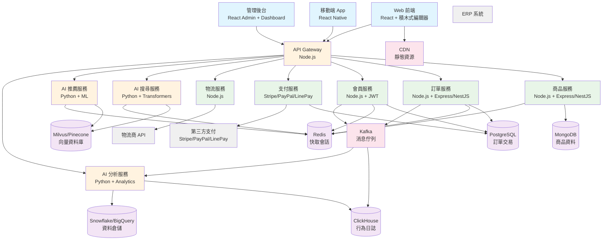
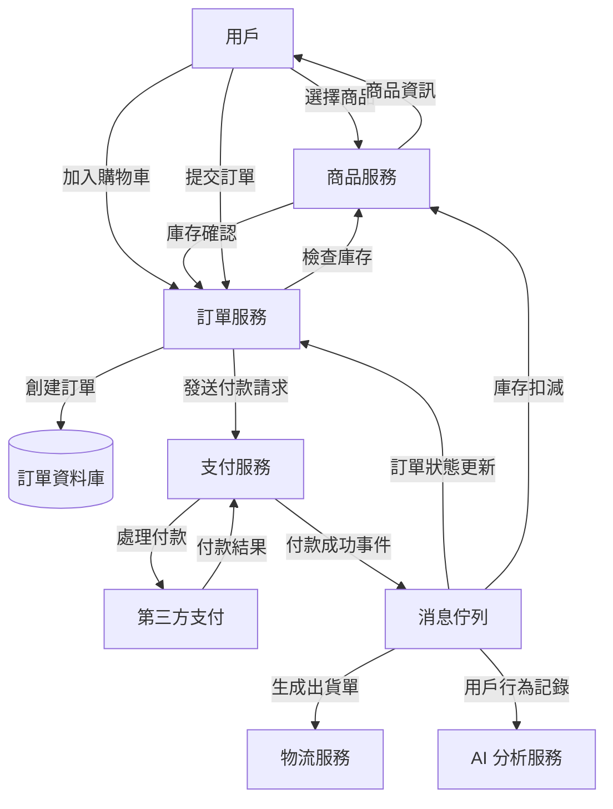
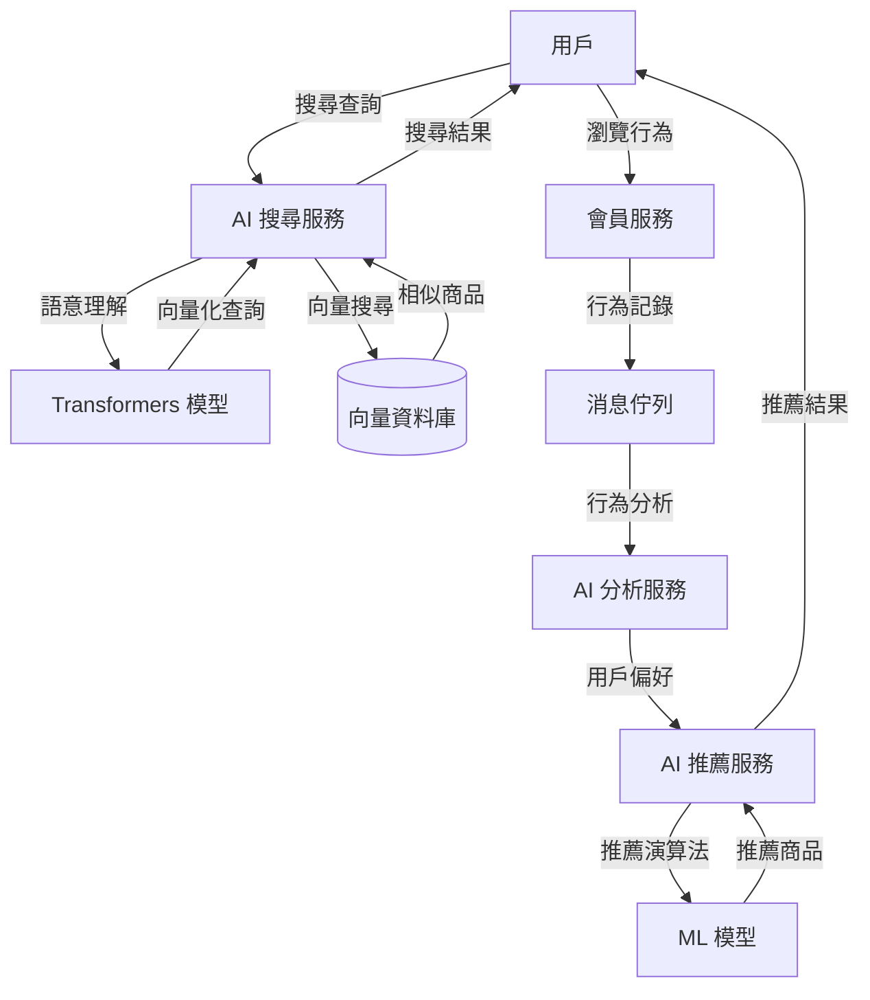
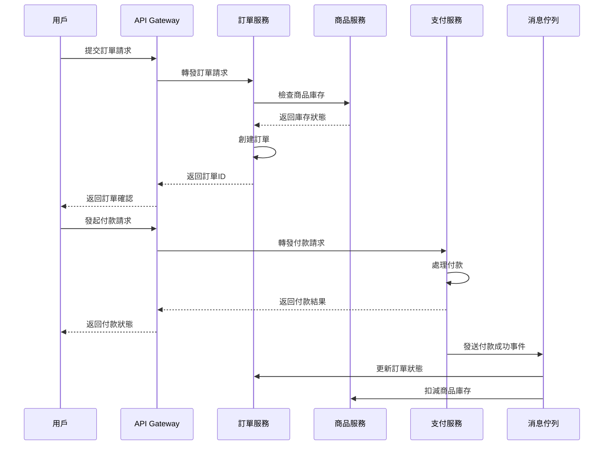
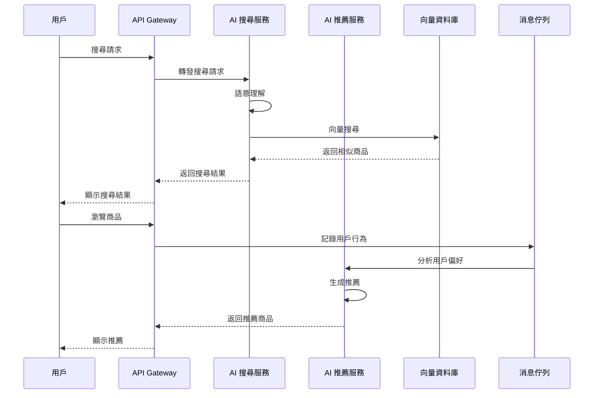

# 系統架構設計文檔 (System Architecture Document) - 電商系統

---

**文件版本 (Document Version):** v1.1

**最後更新 (Last Updated):** 2025-01-03

**主要作者/架構師 (Lead Author/Architect):** 電商系統架構師

**審核者 (Reviewers):** 技術團隊、產品團隊

**狀態 (Status):** 設計中 (In Design)

**相關 PRD/專案簡報:** [連結到 00_project_brief_prd_summary.md](./00_project_brief_prd_summary.md)

**相關 ADRs:** ADR-001 (微服務架構選擇), ADR-002 (資料庫技術選型)

---

## 目錄 (Table of Contents)

1. [引言 (Introduction)](#1-引言-introduction)
2. [架構概述與目標 (Architecture Overview and Goals)](#2-架構概述與目標-architecture-overview-and-goals)
3. [需求回顧 (Requirements Revisited)](#3-需求回顧-requirements-revisited)
4. [高層次架構設計 (High-Level Architectural Design)](#4-高層次架構設計-high-level-architectural-design)
5. [技術選型詳述 (Technology Stack Details)](#5-技術選型詳述-technology-stack-details)
6. [可行性分析概要 (Feasibility Analysis Summary)](#6-可行性分析概要-feasibility-analysis-summary)
7. [Production Readiness Checklist - 初步考量](#7-production-readiness-checklist---初步考量)
8. [未來展望與演進方向 (Future Considerations and Evolution)](#8-未來展望與演進方向-future-considerations-and-evolution)

---

## 1. 引言 (Introduction)

### 1.1 目的與範圍 (Purpose and Scope)
*   **目的 (Purpose):** 為電商系統提供一個清晰、一致的高層次架構藍圖，指導後續的詳細設計和開發實施
*   **範圍 (Scope):** 涵蓋電商系統的核心業務模組，包括商品管理、訂單處理、會員服務、支付整合、物流配送、AI 搜尋推薦和 ERP 整合

### 1.2 目標讀者 (Target Audience)
*   專案開發團隊、架構師、產品經理、測試團隊、運維團隊、技術主管

### 1.3 術語表 (Glossary)

| 術語/縮寫 | 完整名稱/解釋 |
| :------- | :----------- |
| DDD | Domain-Driven Design (領域驅動設計) |
| CQRS | Command Query Responsibility Segregation (命令查詢職責分離) |
| API Gateway | API 閘道，統一管理 API 請求的入口點 |
| ERP | Enterprise Resource Planning (企業資源規劃) |
| ML | Machine Learning (機器學習) |
| NLP | Natural Language Processing (自然語言處理) |

### 1.4 參考文件 (References)
*   PRD/專案簡報: [00_project_brief_prd_summary.md](./00_project_brief_prd_summary.md)
*   電商行業最佳實踐指南
*   微服務架構設計模式

---

## 2. 架構概述與目標 (Architecture Overview and Goals)

### 2.1 系統願景與核心價值 (System Vision and Core Values)
*   建立一個高可用、可擴展、易維護的智能電商平台，為用戶提供優秀的購物體驗，為商家提供高效的管理工具，通過 AI 技術提升個人化服務品質

### 2.2 架構目標與原則 (Architectural Goals and Principles)
*   **架構目標 (Goals):**
    *   系統可用性達到 99.9% 以上
    *   支援 P95 延遲在 500ms 以下處理 10,000 QPS 的併發請求
    *   新功能模組的平均開發和部署週期小於 2 週
    *   AI 模型準確率達到 85% 以上
*   **設計原則 (Principles):**
    *   領域驅動設計 (DDD) - 以業務領域為核心組織代碼
    *   微服務架構 - 服務間松耦合，單一職責
    *   API 優先 - 所有服務通過 API 進行通信
    *   事件驅動 - 使用事件進行服務間的異步通信
    *   無狀態服務 - 服務本身不保存狀態，便於擴展
    *   AI 驅動 - 利用機器學習提升用戶體驗和營運效率

### 2.3 主要制約因素與假設 (Key Constraints and Assumptions)
*   **制約因素 (Constraints):**
    *   需要與現有 ERP 系統整合
    *   必須符合資料保護和隱私法規
    *   初期預算限制，優先考慮開源技術
    *   AI 模型需要 GPU 資源支援
*   **假設 (Assumptions):**
    *   初期用戶量在 10 萬以內，日訂單量在 1 萬筆以內
    *   團隊具備 Node.js 和 Python 開發經驗
    *   可以使用雲端服務進行部署
    *   AI 模型訓練和推理可以分離部署

---

## 3. 需求回顧 (Requirements Revisited)

### 3.1 功能性需求摘要 (Functional Requirements Summary)
*   商品管理: 商品 CRUD、分類管理、庫存同步 (對應 User Story US-001)
*   訂單管理: 訂單創建、狀態流轉、退換貨處理 (對應 User Story US-002)
*   會員管理: 用戶註冊登入、個人資料、購物歷史 (對應 User Story US-003)
*   支付處理: 多種支付方式、交易安全、對帳功能 (對應 User Story US-004)
*   物流配送: 配送方式選擇、物流追蹤、配送狀態更新 (對應 User Story US-005)
*   AI 搜尋: 語意搜尋、多條件檢索、關鍵字建議 (對應 User Story US-002)
*   AI 推薦: 個人化推薦、協同過濾、即時推薦 (對應 User Story US-003)
*   AI 分析: 營運分析、庫存預測、行銷效果分析 (對應 User Story US-005)
*   ERP 整合: 庫存同步、財務整合、自動化採購 (對應 User Story US-006)
*   安全權限: 身份驗證、角色權限、API 存取控管 (對應 User Story US-007)

### 3.2 非功能性需求 (Non-Functional Requirements - NFRs)

| NFR 分類 | 具體需求描述 | 衡量指標/目標值 |
| :--------------- | :--------------------------------------------------------------------------- | :---------------------------------------- |
| **性能 (Performance)** | API 端點平均響應時間 | < 500ms (P95) |
| | 系統吞吐量 | 10,000 TPS |
| | AI 模型推理時間 | < 200ms (P95) |
| **可擴展性 (Scalability)** | 系統應能處理用戶量 10 倍增長 | 支持線性擴展至 100 個節點 |
| | AI 模型支持水平擴展 | 支持多實例並行推理 |
| **可用性 (Availability)** | 核心服務的年可用性 | 99.9% (SLA) |
| | AI 服務的年可用性 | 99.5% (SLA) |
| **可靠性 (Reliability)** | 數據丟失容忍度 | RPO < 1 hour |
| | AI 模型準確率 | > 85% |
| **安全性 (Security)** | 數據傳輸加密標準 | TLS 1.3+ |
| | 身份驗證機制 | OAuth 2.0 / JWT |
| | AI 模型安全 | 防止對抗攻擊 |
| **可維護性 (Maintainability)** | 新開發者上手時間 | < 5 天熟悉核心模組 |
| | 代碼複雜度 | 平均圈複雜度 < 10 |
| | AI 模型版本管理 | 支持模型 A/B 測試 |
| **可觀測性 (Observability)** | 關鍵業務指標監控覆蓋率 | 100% 覆蓋，延遲 < 1 分鐘 |
| | AI 模型監控 | 模型性能指標實時監控 |

---

## 4. 高層次架構設計 (High-Level Architectural Design)

### 4.1 選定的架構模式 (Chosen Architectural Pattern)
*   **微服務架構 (Microservices Architecture)** 結合 **領域驅動設計 (DDD)** 和 **AI 驅動設計**
*   **選擇理由:** 
    *   支持團隊獨立開發和部署不同業務模組
    *   便於系統擴展和維護
    *   符合電商業務的複雜性和多樣性需求
    *   支持不同模組使用最適合的技術棧
    *   AI 服務需要獨立的 Python 環境和 GPU 資源

### 4.2 系統組件圖 (System Component Diagram)

### 4.3 主要組件/服務及其職責 (Key Components/Services and Responsibilities)

#### ⚠️ 當前實現狀況 (Current Implementation Status)

**重要問題**: 當前實現與設計存在重大差異！

| 組件/服務名稱 | 設計狀態 | 實際狀態 | 核心職責 | 主要技術/框架 | 資料庫 | 狀態 |
| :-------------------- | :------ | :------ | :-------------------------------------------------------- | :------------------- | :------ | :------ |
| **已實現服務** |
| API Gateway | ✅ 設計 | ❌ 未實現 | 統一 API 入口、路由、認證、限流 | Node.js + Express | - | ❌ 缺失 |
| 商品服務 | ✅ 設計 | ✅ 已實現 | 商品 CRUD、分類管理、庫存管理 | Node.js + Express | MongoDB | ✅ 正確 |
| 訂單服務 | ✅ 設計 | ✅ 已實現 | 訂單創建、狀態管理、退換貨 | Node.js + Express | MongoDB | ❌ 應用 PostgreSQL |
| 會員服務 | ✅ 設計 | ✅ 已實現 | 用戶註冊、個人資料、會員等級 | Node.js + JWT | MongoDB | ❌ 應用 PostgreSQL |
| 支付服務 | ✅ 設計 | ✅ 已實現 | 支付處理、交易記錄、對帳 | Node.js + Express | MongoDB | ❌ 應用 PostgreSQL |
| 物流服務 | ✅ 設計 | ✅ 已實現 | 配送管理、物流追蹤 | Node.js + Express | MongoDB | ❌ 應用 PostgreSQL |
| 權限服務 | ✅ 設計 | ✅ 已實現 | RBAC 權限管理、角色控制 | Node.js + Express | MongoDB | ❌ 應用 PostgreSQL |
| 設定服務 | ✅ 設計 | ✅ 已實現 | 系統設定、配置管理 | Node.js + Express | MongoDB | ❌ 應用 PostgreSQL |
| 分析服務 | ✅ 設計 | ✅ 已實現 | 營運分析、數據統計 | Node.js + Express | MongoDB | ❌ 應應用 ClickHouse |
| 儀表板服務 | ✅ 設計 | ✅ 已實現 | 管理後台、數據展示 | Node.js + Express | MongoDB | ❌ 應應用 PostgreSQL |
| MinIO 服務 | ✅ 設計 | ✅ 已實現 | 文件存儲、圖片管理 | MinIO | MongoDB | ✅ 正確 |
| **未實現服務** |
| AI 搜尋服務 | ✅ 設計 | ❌ 未實現 | 語意搜尋、多條件檢索 | Python + Transformers | Milvus/Pinecone | ❌ 未實現 |
| AI 推薦服務 | ✅ 設計 | ❌ 未實現 | 個人化推薦、協同過濾 | Python + ML | Milvus/Pinecone | ❌ 未實現 |
| ERP 整合服務 | ✅ 設計 | ❌ 未實現 | 與 ERP 系統數據同步 | Node.js | PostgreSQL | ❌ 未實現 |
| 認證授權服務 | ✅ 設計 | ❌ 未實現 | JWT 管理、角色權限控制 | Node.js + JWT | PostgreSQL | ❌ 未實現 |

#### 🎯 目標架構 (Target Architecture)

**正確的服務與資料庫對應關係**:

| 服務類型 | 資料庫選擇 | 理由 |
|----------|------------|------|
| **結構化交易資料** | PostgreSQL | ACID 特性、關係型查詢、數據完整性 |
| **非結構化商品資料** | MongoDB | 靈活的 JSON 結構、商品屬性多變 |
| **向量搜尋資料** | Milvus/Pinecone | 專業向量搜尋、AI 推薦 |
| **時序分析資料** | ClickHouse | 高效能分析、大量聚合查詢 |
| **快取和會話** | Redis | 高性能、即時存取 |
| **消息流** | Kafka | 即時數據流、事件驅動 |

### 4.4 資料流圖 (Data Flow Diagrams - DFDs)

#### DFD 1: 用戶下單流程

#### DFD 2: AI 搜尋推薦流程

### 4.5 請求流/交互時序圖 (Request Flow / Interaction Sequence Diagrams)

#### 場景 1: 用戶下單流程

#### 場景 2: AI 搜尋推薦流程

---

## 5. 技術選型詳述 (Technology Stack Details)

### 5.1 前端技術棧 (Frontend Stack)
*   **主要框架/函式庫:** React 18+ / Vue 3+
    *   **選擇理由:** 支援積木式頁面編輯器開發，組件化架構適合拖拉功能
*   **狀態管理:** Redux Toolkit / Pinia
    *   **選擇理由:** 管理複雜的編輯器狀態和用戶互動
*   **特殊功能庫:** React DnD / Vue Draggable
    *   **選擇理由:** 實現積木式頁面編輯器的拖拉功能
*   **UI 元件庫:** Ant Design / React Admin
    *   **選擇理由:** 豐富的管理後台組件和 Dashboard 元件
*   **部署方式:** CDN + SPA 應用

### 5.2 後端技術棧 (Backend Stack)
*   **主要語言/運行時:** Node.js
    *   **選擇理由:** 快速開發，高併發處理，與前端技術棧統一，豐富的 NPM 生態系統
*   **主要框架:** Express / NestJS
    *   **選擇理由:** Express 輕量快速，NestJS 提供企業級架構和 TypeScript 支援
*   **認證機制:** JWT + Redis Session
    *   **選擇理由:** 無狀態認證，支援分散式部署
*   **API 規格語言:** OpenAPI v3.x
    *   **選擇理由:** 業界標準，支持自動化文檔生成和測試

### 5.3 AI/ML 技術棧 (AI/ML Stack)
*   **主要語言:** Python
    *   **選擇理由:** 豐富的 ML 生態系統，成熟的 AI 函式庫
*   **搜尋技術:** Hugging Face Transformers + Embedding
    *   **選擇理由:** 支援語意搜尋和自然語言處理
*   **推薦技術:** Scikit-learn / LightFM + 協同過濾
    *   **選擇理由:** 成熟的推薦演算法實現
*   **分析技術:** Pandas / Numpy / Scikit-learn / Prophet / LSTM
    *   **選擇理由:** 全面的資料分析和預測能力
*   **異常偵測:** Isolation Forest
    *   **選擇理由:** 無監督異常偵測，適合營運監控

### 5.4 資料庫與儲存 (Databases and Storage)
*   **商品資料:** MongoDB
    *   **選擇理由:** 支援靈活的商品屬性結構，JSON 格式適合多變的商品屬性
*   **交易資料:** PostgreSQL
    *   **選擇理由:** ACID 特性保證訂單和支付資料的完整性
*   **快取儲存:** Redis
    *   **選擇理由:** 高性能記憶體資料庫，支援會話管理和即時快取
*   **向量資料庫:** Milvus / Pinecone
    *   **選擇理由:** 專業向量搜尋，支援 AI 推薦和語意搜尋功能
*   **行為日誌:** ClickHouse
    *   **選擇理由:** 高效能時序資料分析，支援大量用戶行為資料查詢
*   **資料倉儲:** Snowflake / BigQuery / Redshift
    *   **選擇理由:** 支援複雜的商業智能分析和歷史資料查詢

### 5.5 訊息佇列/事件流 (Message Queues/Event Streaming)
*   **選用技術:** Apache Kafka / RabbitMQ
*   **使用場景:** 
    *   即時用戶行為收集和分析
    *   AI 模型即時更新和推薦
    *   異步任務處理和事件驅動架構
*   **選擇理由:** Kafka 支援高吞吐量資料流，RabbitMQ 提供可靠的消息傳遞

### 5.6 基礎設施與部署 (Infrastructure and Deployment)
*   **雲服務商:** AWS (生產環境) / 本地 Docker (開發環境)
    *   **選擇理由:** 成熟的雲端服務，豐富的 PaaS 產品
*   **容器化技術:** Docker
*   **容器編排:** Kubernetes (EKS)
    *   **選擇理由:** 業界標準，支持自動擴展和服務發現
*   **CI/CD 工具:** GitHub Actions
    *   **選擇理由:** 與代碼倉庫整合度高，配置簡單
*   **IaC 工具:** Terraform
    *   **選擇理由:** 支持多雲部署，狀態管理完善

### 5.7 可觀測性工具 (Observability Stack)
*   **日誌管理:** ELK Stack (Elasticsearch, Logstash, Kibana)
    *   **選擇理由:** 開源方案，功能完整，社區支持良好
*   **指標監控:** Prometheus + Grafana
    *   **選擇理由:** 雲原生監控標準，與 Kubernetes 整合度高
*   **分散式追蹤:** Jaeger
    *   **選擇理由:** CNCF 項目，與微服務整合良好
*   **告警:** Alertmanager + PagerDuty
    *   **選擇理由:** 支持多種通知方式，告警規則靈活

---

## 6. 可行性分析概要 (Feasibility Analysis Summary)

### 6.1 技術可行性評估 (Technical Feasibility)
*   **核心技術挑戰:** 微服務間的數據一致性、高併發下的性能優化、AI 模型的部署和維護
*   **解決方案:** 採用 Saga 模式處理分散式事務，使用 Redis 快取提升性能，AI 模型容器化部署
*   **團隊能力:** 團隊具備 Node.js 和 Python 開發經驗，需要補強微服務和 Kubernetes 技能

### 6.2 經濟可行性/成本效益分析 (Economic Feasibility / Cost-Benefit)
*   **預估開發成本:** 8 個月，10 人團隊，約 300 萬台幣
*   **預估運維成本:** 每月約 15 萬台幣（AWS 基礎設施 + GPU 資源）
*   **預期收益:** 提升運營效率 40%，降低人工成本，支持業務快速擴展，AI 驅動的個人化服務提升用戶體驗

### 6.3 時程可行性與資源預估 (Schedule Feasibility and Resource Estimation)
*   **開發時程:** 8 個月可完成 MVP 版本
*   **資源需求:** 前端開發 2 人、後端開發 4 人、AI 開發 2 人、DevOps 1 人、測試 1 人
*   **關鍵路徑:** ERP 整合、第三方支付整合、AI 模型訓練和部署

### 6.4 關鍵風險識別與緩解策略 (Key Risks and Mitigation Strategies)

| 風險描述 | 核心緩解策略 |
| :----------------------- | :------------------------------------- |
| 微服務複雜度管理 | 採用 DDD 方法論，明確服務邊界 |
| 第三方 API 整合風險 | 提前進行 POC 驗證，準備備選方案 |
| 數據一致性問題 | 使用事件溯源和 Saga 模式 |
| 性能瓶頸風險 | 進行充分的負載測試和性能調優 |
| AI 模型準確率不足 | 建立模型評估和持續改進機制 |
| GPU 資源成本高 | 使用 Spot Instances 和模型優化 |

---

## 7. Production Readiness Checklist (PRC) - 初步考量

*   **可觀測性 (Observability):**
    *   核心業務指標：訂單成功率、支付成功率、頁面載入時間
    *   系統指標：CPU、記憶體、磁碟使用率、API 響應時間
    *   AI 指標：模型準確率、推理時間、模型版本
    *   日誌格式：結構化 JSON 格式，包含 traceId 和 spanId
*   **可擴展性 (Scalability):**
    *   API Gateway 和資料庫可能成為瓶頸
    *   採用水平擴展策略，支持自動擴展
    *   AI 服務支持模型並行推理
    *   需要進行容量規劃和負載測試
*   **安全性與機密管理 (Security & Secrets):**
    *   主要威脅：SQL 注入、XSS 攻擊、未授權存取、AI 對抗攻擊
    *   數據加密：傳輸層 TLS 1.3，儲存層 AES-256
    *   API 認證：OAuth 2.0 + JWT
    *   機密管理：AWS Secrets Manager
    *   AI 安全：模型輸入驗證、對抗攻擊防護
*   **可靠性與容錯 (Reliability & Fault Tolerance):**
    *   單點故障：API Gateway 需要高可用部署
    *   重試機制：指數退避重試，斷路器模式
    *   災難恢復：跨可用區部署，自動備份
    *   AI 服務容錯：模型降級策略、備用模型
*   **合規性 (Compliance):**
    *   個人資料保護法合規
    *   PCI DSS 支付卡行業安全標準
    *   AI 倫理和透明度要求
*   **部署與回滾 (Deployment & Rollback):**
    *   藍綠部署策略，零停機部署
    *   自動化回滾機制，5 分鐘內完成回滾
    *   AI 模型版本管理和 A/B 測試

---

## 8. 架構修正計劃 (Architecture Refactoring Plan)

### 🚨 緊急修正項目 (Critical Issues)

#### 8.1 資料庫架構修正
- [ ] **添加 PostgreSQL 服務**
  - [ ] 在 docker-compose.yml 中添加 PostgreSQL 服務
  - [ ] 配置 PostgreSQL 環境變數和連接字串
  - [ ] 創建數據庫初始化腳本和 schema
  - [ ] 設置 PostgreSQL 備份和監控

- [ ] **遷移服務到 PostgreSQL**
  - [ ] User Service: Mongoose → Sequelize/TypeORM
  - [ ] Order Service: Mongoose → Sequelize/TypeORM  
  - [ ] Permission Service: Mongoose → Sequelize/TypeORM
  - [ ] Auth Service: Mongoose → Sequelize/TypeORM
  - [ ] Settings Service: Mongoose → Sequelize/TypeORM
  - [ ] Payment Service: Mongoose → Sequelize/TypeORM
  - [ ] Logistics Service: Mongoose → Sequelize/TypeORM
  - [ ] Inventory Service: Mongoose → Sequelize/TypeORM
  - [ ] Dashboard Service: Mongoose → Sequelize/TypeORM

- [ ] **保留 MongoDB 服務**
  - [ ] Product Service: 繼續使用 MongoDB (適合商品數據)
  - [ ] Analytics Service: 繼續使用 MongoDB (適合分析數據)
  - [ ] MinIO Service: 繼續使用 MongoDB (適合文件元數據)

#### 8.2 缺失服務實現
- [ ] **API Gateway**
  - [ ] 實現統一 API 入口
  - [ ] 添加路由、認證、限流功能
  - [ ] 整合所有微服務

- [ ] **認證授權服務**
  - [ ] 實現 JWT 管理
  - [ ] 添加角色權限控制
  - [ ] 整合權限服務

- [ ] **AI 服務實現**
  - [ ] 添加 Milvus/Pinecone 向量資料庫
  - [ ] 添加 ClickHouse 時序資料庫
  - [ ] 添加 Kafka 消息佇列
  - [ ] 實現 AI 搜尋和推薦服務

#### 8.3 數據遷移和測試
- [ ] 創建數據遷移腳本
- [ ] 備份現有數據
- [ ] 執行數據遷移
- [ ] 驗證數據完整性
- [ ] 更新 API 測試
- [ ] 更新前端集成測試

### 📝 修正理由
1. **數據一致性**: PostgreSQL 的 ACID 特性更適合交易數據
2. **查詢性能**: 關係型查詢在用戶、訂單、權限方面更高效
3. **數據完整性**: 外鍵約束確保數據關係正確
4. **擴展性**: PostgreSQL 在複雜查詢和報表方面更強
5. **標準化**: 符合企業級應用的數據庫選擇標準

### ⚠️ 注意事項
- 數據遷移期間需要停機維護
- 需要更新所有相關的 API 文檔
- 前端可能需要調整數據格式
- 需要重新設計數據備份策略
- 團隊需要學習 PostgreSQL 和相關 ORM

## 9. 未來展望與演進方向 (Future Considerations and Evolution)

*   **功能擴展:**
    *   支持多租戶架構，服務 B2B 客戶
    *   整合更多 AI 功能（聊天機器人、視覺搜尋）
    *   支持多語言和多幣別
    *   實現邊緣計算和本地 AI 推理
*   **技術演進:**
    *   考慮採用 Event Sourcing 模式
    *   引入更先進的機器學習模型（Transformer、GNN）
    *   探索 Serverless 架構降低運維成本
    *   實現 AI 模型的持續學習和自動更新

---

**文件審核記錄 (Review History):**

| 日期 | 審核人 | 版本 | 變更摘要/主要反饋 |
| :--------- | :--------- | :--- | :---------------------------------------------- |
| 2025-01-03 | 電商系統架構師 | v1.0 | 初稿提交 |
| 2025-01-03 | 電商系統架構師 | v1.1 | 更新為 Node.js 技術棧，新增 AI 服務架構 |
| 2025-09-06 | 電商系統架構師 | v1.2 | 更新：發現當前實現與設計不符，添加架構修正計劃 |