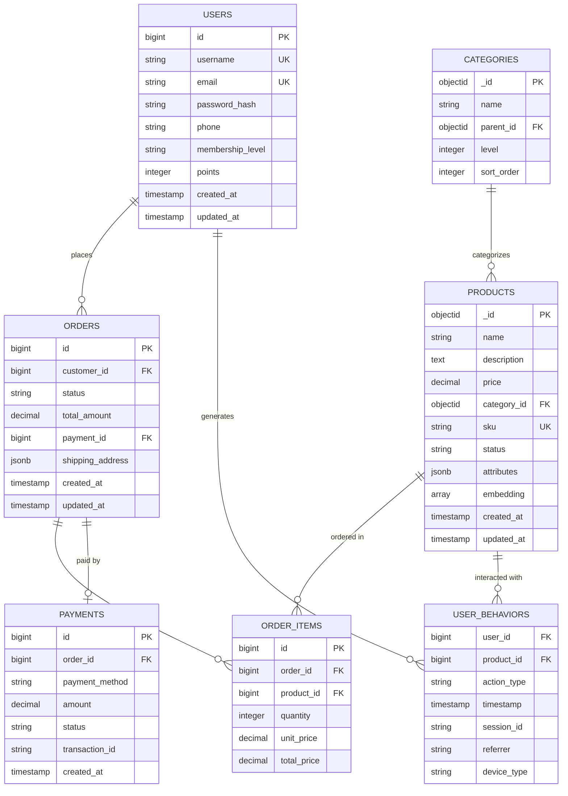
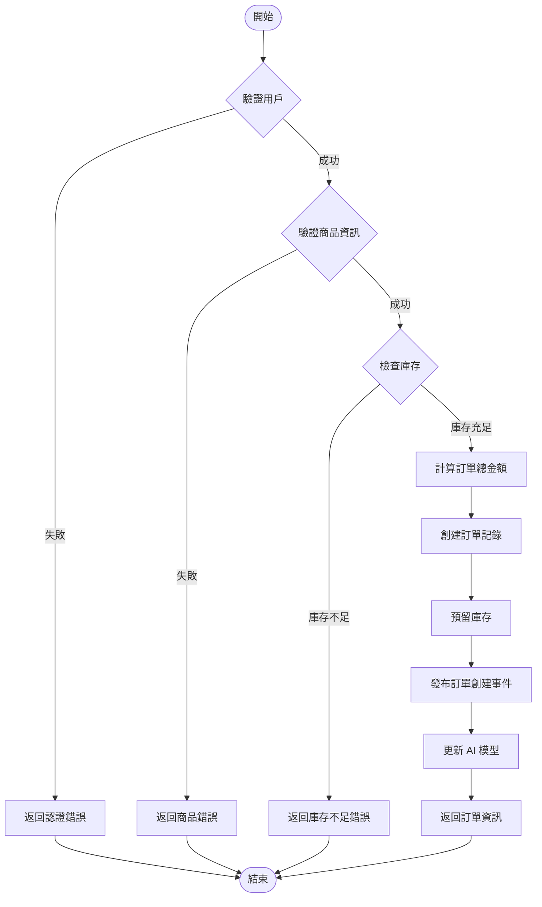
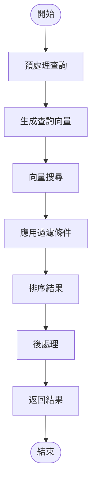
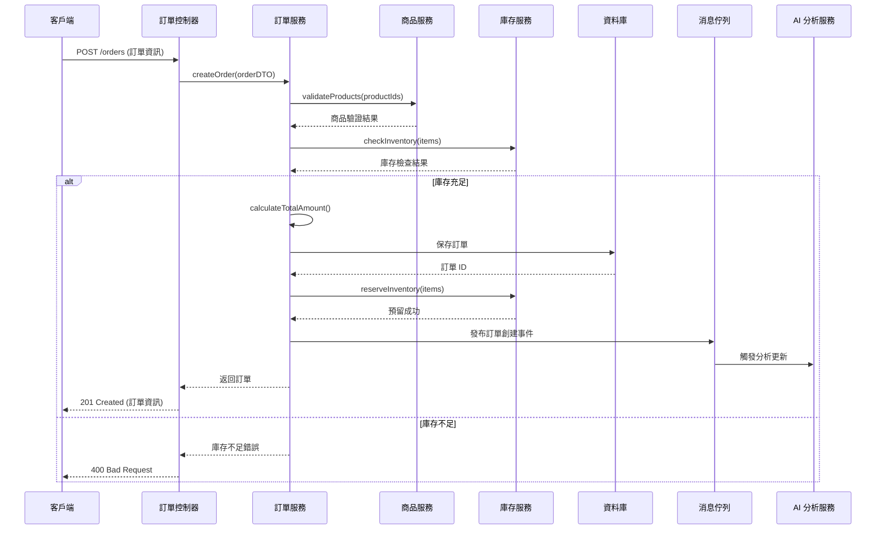
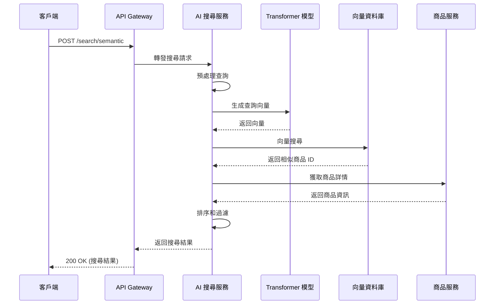
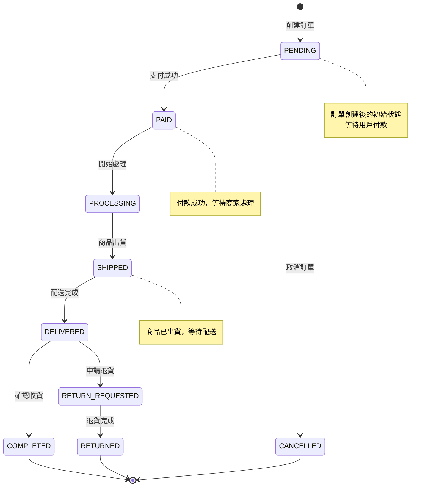
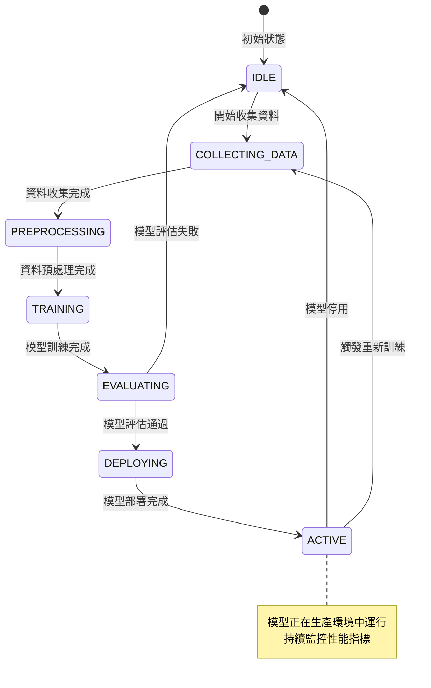

# 系統詳細設計文檔 (System Design Document) - 電商系統核心服務

---

**文件版本 (Document Version):** v1.1

**最後更新 (Last Updated):** 2025-01-03

**主要作者/設計師 (Lead Author/Designer):** 電商系統設計師

**審核者 (Reviewers):** 開發團隊、架構師、產品經理

**狀態 (Status):** 設計中 (In Design)

**相關系統架構文檔 (SA Document):** [02_system_architecture_document.md](./02_system_architecture_document.md)

**相關 User Stories/Features:** US-001 (商品管理), US-002 (訂單管理), US-003 (會員管理), US-004 (AI 搜尋), US-005 (AI 推薦)

**相關 ADRs:** ADR-001 (微服務架構), ADR-002 (資料庫技術選型)

---

## 目錄 (Table of Contents)

1. [引言 (Introduction)](#1-引言-introduction)
2. [模組/功能概述 (Module/Feature Overview)](#2-模組功能概述-modulefeature-overview)
3. [詳細設計 (Detailed Design)](#3-詳細設計-detailed-design)
4. [設計考量 (Design Considerations)](#4-設計考量-design-considerations)
5. [介面定義 (Interface Definitions)](#5-介面定義-interface-definitions)
6. [未來展望 (Future Considerations)](#6-未來展望-future-considerations)

---

## 1. 引言 (Introduction)

### 1.1 目的 (Purpose)
*   為電商系統的核心服務（商品服務、訂單服務、會員服務、AI 服務）提供具體的實現細節和規格，指導開發和測試工作

### 1.2 範圍 (Scope)
*   涵蓋商品管理、訂單處理、會員管理、AI 搜尋推薦、AI 分析五個核心業務模組的詳細設計

### 1.3 術語表 (Glossary)

| 術語/縮寫 | 完整名稱/解釋 |
| :------- | :----------- |
| SKU | Stock Keeping Unit (庫存單位) |
| DTO | Data Transfer Object (資料傳輸物件) |
| JWT | JSON Web Token |
| ML | Machine Learning (機器學習) |
| NLP | Natural Language Processing (自然語言處理) |
| Embedding | 向量嵌入，將文字轉換為數值向量 |

### 1.4 參考文件 (References)
*   系統架構文檔: [02_system_architecture_document.md](./02_system_architecture_document.md)
*   相關 PRD: [00_project_brief_prd_summary.md](./00_project_brief_prd_summary.md)
*   ADR-001: 微服務架構選擇
*   ADR-002: 資料庫技術選型

---

## 2. 模組/功能概述 (Module/Feature Overview)

### 2.1 功能描述 (Functional Description)
*   **商品服務：** 負責商品資訊管理、分類管理、屬性管理和上下架控制
*   **訂單服務：** 負責訂單創建、狀態管理、結帳流程和退換貨處理
*   **會員服務：** 負責用戶註冊登入、行為追蹤、會話管理和個人資料
*   **AI 搜尋服務：** 負責語意搜尋、多條件檢索和關鍵字建議
*   **AI 推薦服務：** 負責個人化推薦、協同過濾和即時推薦
*   **AI 分析服務：** 負責營運分析、庫存預測、行銷效果分析和異常偵測

### 2.2 與系統其他部分的關係 (Relationship to Other System Parts)
*   **輸入 (Inputs):** 
    *   來自 API Gateway 的 HTTP 請求
    *   來自消息佇列的事件消息
    *   來自外部系統的資料同步請求
    *   來自用戶行為的即時資料流
*   **輸出 (Outputs):** 
    *   HTTP 回應給前端應用
    *   事件消息到消息佇列
    *   資料同步到 ERP 系統
    *   AI 模型預測結果
*   **依賴 (Dependencies):** 
    *   MongoDB/PostgreSQL 資料庫
    *   Redis 快取和會話儲存
    *   Kafka/RabbitMQ 消息佇列
    *   Milvus/Pinecone 向量資料庫
    *   ClickHouse 行為日誌資料庫
    *   JWT 認證機制
    *   GPU 資源 (AI 服務)

---

## 3. 詳細設計 (Detailed Design)

### 3.1 模組結構與組件設計 (Module Structure and Component Design)

#### 3.1.1 類別圖/組件圖 (Class/Component Diagrams)

```mermaid
classDiagram
    %% 商品服務類別圖 (Node.js)
    class ProductController {
        +createProduct(req, res): Promise~Response~
        +updateProduct(req, res): Promise~Response~
        +getProduct(req, res): Promise~Response~
        +searchProducts(req, res): Promise~Response~
        +deleteProduct(req, res): Promise~Response~
    }
    
    class ProductService {
        -productRepository: ProductRepository
        -categoryRepository: CategoryRepository
        -searchService: SearchService
        +createProduct(productData): Promise~Product~
        +updateProduct(id, productData): Promise~Product~
        +getProductById(id): Promise~Product~
        +searchProducts(searchQuery): Promise~Product[]~
        +deleteProduct(id): Promise~void~
    }
    
    class Product {
        -_id: ObjectId
        -name: String
        -description: String
        -price: Number
        -categoryId: ObjectId
        -sku: String
        -status: String
        -attributes: Object
        -imageUrls: String[]
        -createdAt: Date
        -updatedAt: Date
    }
    
    %% 訂單服務類別圖 (Node.js)
    class OrderController {
        +createOrder(req, res): Promise~Response~
        +getOrder(req, res): Promise~Response~
        +updateOrderStatus(req, res): Promise~Response~
        +processPayment(req, res): Promise~Response~
    }
    
    class OrderService {
        -orderRepository: OrderRepository
        -paymentService: PaymentService
        -kafkaProducer: KafkaProducer
        +createOrder(orderData): Promise~Order~
        +getOrderById(id): Promise~Order~
        +updateOrderStatus(id, status): Promise~Order~
        +processPayment(orderId, paymentData): Promise~Payment~
    }
    
    class Order {
        -id: Number
        -customerId: Number
        -status: String
        -totalAmount: Number
        -paymentId: Number
        -shippingAddress: Object
        -items: OrderItem[]
        -createdAt: Date
        -updatedAt: Date
    }
    
    %% 會員服務類別圖 (Node.js)
    class UserController {
        +register(req, res): Promise~Response~
        +login(req, res): Promise~Response~
        +getProfile(req, res): Promise~Response~
        +trackBehavior(req, res): Promise~Response~
    }
    
    class UserService {
        -userRepository: UserRepository
        -jwtService: JWTService
        -redisClient: RedisClient
        -behaviorTracker: BehaviorTracker
        +register(userData): Promise~User~
        +login(credentials): Promise~AuthResult~
        +getUserById(id): Promise~User~
        +trackUserBehavior(userId, action): Promise~void~
    }
    
    class User {
        -id: Number
        -username: String
        -email: String
        -passwordHash: String
        -phone: String
        -profile: Object
        -createdAt: Date
        -updatedAt: Date
    }
    
    %% AI 服務類別圖 (Python)
    class SearchService {
        -vectorDB: VectorDatabase
        -transformer: TransformerModel
        -embeddingModel: EmbeddingModel
        +semanticSearch(query): Promise~SearchResult[]~
        +generateEmbedding(text): Promise~Vector~
        +suggestKeywords(query): Promise~String[]~
        +updateProductEmbeddings(): Promise~void~
    }
    
    class RecommendationService {
        -vectorDB: VectorDatabase
        -collaborativeFilter: CollaborativeFilter
        -contentBasedFilter: ContentBasedFilter
        +getPersonalizedRecommendations(userId): Promise~Product[]~
        +getSimilarProducts(productId): Promise~Product[]~
        +updateUserPreferences(userId, interactions): Promise~void~
        +trainModel(): Promise~void~
    }
    
    class AnalyticsService {
        -clickhouseClient: ClickHouseClient
        -salesPredictor: SalesPredictor
        -inventoryPredictor: InventoryPredictor
        -anomalyDetector: AnomalyDetector
        +analyzeSalesTrend(): Promise~TrendAnalysis~
        +predictInventory(productId): Promise~InventoryPrediction~
        +detectAnomalies(): Promise~Anomaly[]~
        +generateReport(type): Promise~Report~
        +updateModels(): Promise~void~
    }
    
    %% 關係
    ProductController ..> ProductService : uses
    ProductService ..> SearchService : integrates
    OrderController ..> OrderService : uses
    UserController ..> UserService : uses
    UserService ..> RecommendationService : integrates
    AnalyticsService ..> SearchService : uses data
    AnalyticsService ..> RecommendationService : uses data
```



#### 3.1.2 主要類別/介面/函式詳述 (Key Classes/Interfaces/Functions Details)

**`ProductService`**
*   **職責 (Responsibility):** 處理商品相關的業務邏輯，包括商品 CRUD、庫存管理、搜尋功能
*   **主要方法/函式簽名 (Methods/Function Signatures):**
    *   `createProduct(ProductCreateDTO dto) -> Product`
        *   **描述:** 創建新商品，驗證商品資訊並儲存到資料庫
        *   **參數:** ProductCreateDTO - 包含商品基本資訊的 DTO
        *   **回傳:** Product - 創建成功的商品實體
        *   **前置條件:** 商品名稱不能為空，價格必須大於 0
        *   **後置條件:** 商品已儲存到資料庫，庫存記錄已創建
    *   `updateProduct(Long id, ProductUpdateDTO dto) -> Product`
        *   **描述:** 更新現有商品資訊
        *   **參數:** id - 商品 ID, dto - 更新資訊
        *   **回傳:** Product - 更新後的商品實體
        *   **主要邏輯步驟:**
            ```
            1. 驗證商品是否存在
            2. 檢查更新權限
            3. 驗證更新資料
            4. 更新商品資訊
            5. 發送商品更新事件
            6. 觸發 AI 模型更新
            ```

**`OrderService`**
*   **職責 (Responsibility):** 處理訂單相關的業務邏輯，包括訂單創建、狀態管理、支付整合
*   **主要方法/函式簽名 (Methods/Function Signatures):**
    *   `createOrder(OrderCreateDTO dto) -> Order`
        *   **描述:** 創建新訂單，檢查庫存並計算總金額
        *   **參數:** OrderCreateDTO - 包含訂單資訊的 DTO
        *   **回傳:** Order - 創建成功的訂單實體
        *   **主要邏輯步驟:**
            ```
            1. 驗證用戶身份
            2. 檢查商品庫存
            3. 計算訂單總金額
            4. 創建訂單記錄
            5. 預留庫存
            6. 發送訂單創建事件
            7. 觸發 AI 分析更新
            ```

**`UserService`**
*   **職責 (Responsibility):** 處理用戶相關的業務邏輯，包括註冊登入、個人資料管理
*   **主要方法/函式簽名 (Methods/Function Signatures):**
    *   `register(UserRegisterDTO dto) -> User`
        *   **描述:** 用戶註冊，驗證用戶資訊並創建帳號
        *   **參數:** UserRegisterDTO - 包含註冊資訊的 DTO
        *   **回傳:** User - 創建成功的用戶實體
        *   **前置條件:** 用戶名和郵箱不能重複
        *   **後置條件:** 用戶帳號已創建，發送歡迎郵件

**`SearchService`**
*   **職責 (Responsibility):** 處理 AI 搜尋相關的業務邏輯，包括語意搜尋、關鍵字建議
*   **主要方法/函式簽名 (Methods/Function Signatures):**
    *   `semanticSearch(query: str, filters: dict) -> List[SearchResult]`
        *   **描述:** 執行語意搜尋，返回相關商品
        *   **參數:** query - 搜尋查詢, filters - 過濾條件
        *   **回傳:** 搜尋結果列表
        *   **主要邏輯步驟:**
            ```
            1. 對查詢進行語意理解
            2. 生成查詢向量
            3. 在向量資料庫中搜尋相似商品
            4. 應用過濾條件
            5. 排序並返回結果
            ```

**`RecommendationService`**
*   **職責 (Responsibility):** 處理 AI 推薦相關的業務邏輯，包括個人化推薦、協同過濾
*   **主要方法/函式簽名 (Methods/Function Signatures):**
    *   `getPersonalizedRecommendations(userId: int) -> List[Product]`
        *   **描述:** 為指定用戶生成個人化推薦
        *   **參數:** userId - 用戶 ID
        *   **回傳:** 推薦商品列表
        *   **主要邏輯步驟:**
            ```
            1. 獲取用戶歷史行為
            2. 計算用戶偏好向量
            3. 結合協同過濾和內容推薦
            4. 應用業務規則過濾
            5. 返回推薦結果
            ```

**`AnalyticsService`**
*   **職責 (Responsibility):** 處理 AI 分析相關的業務邏輯，包括營運分析、預測模型
*   **主要方法/函式簽名 (Methods/Function Signatures):**
    *   `predictInventory(productId: int) -> InventoryPrediction`
        *   **描述:** 預測商品庫存需求
        *   **參數:** productId - 商品 ID
        *   **回傳:** 庫存預測結果
        *   **主要邏輯步驟:**
            ```
            1. 收集歷史銷售資料
            2. 分析季節性和趨勢
            3. 應用機器學習模型
            4. 生成預測結果
            5. 計算置信區間
            ```

### 3.2 API 設計 (API Design)

#### 3.2.1 商品服務 API

**端點 (Endpoint):** `POST /api/v1/products`
*   **描述:** 創建新商品
*   **請求 (Request):**
    *   **Headers:** `Authorization: Bearer <token>`, `Content-Type: application/json`
    *   **請求體 (Body):**
        ```json
        {
          "name": "iPhone 15 Pro",
          "description": "最新款 iPhone",
          "price": 35900.00,
          "categoryId": 1,
          "sku": "IPH15PRO001",
          "attributes": {
            "color": "深空黑色",
            "storage": "256GB",
            "warranty": "1年"
          }
        }
        ```
    *   **資料驗證規則:** name 必填且長度 1-100，price 必須大於 0，sku 必須唯一
*   **回應 (Response):**
    *   **成功 (201 Created):**
        ```json
        {
          "id": 1001,
          "name": "iPhone 15 Pro",
          "description": "最新款 iPhone",
          "price": 35900.00,
          "categoryId": 1,
          "sku": "IPH15PRO001",
          "status": "ACTIVE",
          "attributes": {
            "color": "深空黑色",
            "storage": "256GB",
            "warranty": "1年"
          },
          "createdAt": "2025-01-03T10:00:00Z",
          "updatedAt": "2025-01-03T10:00:00Z"
        }
        ```
    *   **錯誤 (400 Bad Request):**
        ```json
        {
          "error": {
            "code": "VALIDATION_ERROR",
            "message": "商品資訊驗證失敗",
            "details": [
              {
                "field": "price",
                "message": "價格必須大於 0"
              }
            ]
          }
        }
        ```

**端點 (Endpoint):** `GET /api/v1/products/{id}`
*   **描述:** 獲取商品詳情
*   **路徑參數 (Path Parameters):** `id` - 商品 ID (Long)
*   **回應 (Response):**
    *   **成功 (200 OK):** 返回商品詳細資訊
    *   **錯誤 (404 Not Found):** 商品不存在

#### 3.2.2 訂單服務 API

**端點 (Endpoint):** `POST /api/v1/orders`
*   **描述:** 創建新訂單
*   **請求體 (Body):**
    ```json
    {
      "customerId": 1001,
      "items": [
        {
          "productId": 1001,
          "quantity": 1,
          "unitPrice": 35900.00
        }
      ],
      "shippingAddress": {
        "street": "台北市信義區信義路五段7號",
        "city": "台北市",
        "postalCode": "110",
        "country": "台灣"
      }
    }
    ```

#### 3.2.3 AI 搜尋服務 API

**端點 (Endpoint):** `POST /api/v1/search/semantic`
*   **描述:** 語意搜尋商品
*   **請求體 (Body):**
    ```json
    {
      "query": "我想要一台拍照很好的手機",
      "filters": {
        "categoryId": 1,
        "priceRange": {
          "min": 10000,
          "max": 50000
        }
      },
      "limit": 20
    }
    ```
*   **回應 (Response):**
    ```json
    {
      "results": [
        {
          "productId": 1001,
          "name": "iPhone 15 Pro",
          "price": 35900.00,
          "relevanceScore": 0.95,
          "reason": "符合拍照需求"
        }
      ],
      "totalCount": 5,
      "searchTime": 150
    }
    ```

#### 3.2.4 AI 推薦服務 API

**端點 (Endpoint):** `GET /api/v1/recommendations/personalized`
*   **描述:** 獲取個人化推薦
*   **查詢參數:** `userId` - 用戶 ID, `limit` - 推薦數量
*   **回應 (Response):**
    ```json
    {
      "recommendations": [
        {
          "productId": 1001,
          "name": "iPhone 15 Pro",
          "price": 35900.00,
          "confidence": 0.88,
          "reason": "基於您的瀏覽歷史"
        }
      ],
      "totalCount": 10
    }
    ```

#### 3.2.5 AI 分析服務 API

**端點 (Endpoint):** `GET /api/v1/analytics/inventory-prediction/{productId}`
*   **描述:** 獲取庫存預測
*   **路徑參數:** `productId` - 商品 ID
*   **回應 (Response):**
    ```json
    {
      "productId": 1001,
      "currentStock": 50,
      "predictedDemand": {
        "nextWeek": 25,
        "nextMonth": 100,
        "nextQuarter": 300
      },
      "recommendedAction": "INCREASE_STOCK",
      "confidence": 0.85
    }
    ```

### 3.3 資料庫設計 (Data Model / Database Design)

#### ⚠️ 當前實現狀況 (Current Implementation Status)

**重要問題**: 當前所有服務都使用 MongoDB，這與設計不符！

#### 3.3.1 實際資料庫表結構/Schema

**表名: `products` (MongoDB) - ✅ 正確**

```javascript
{
  "_id": ObjectId,
  "name": String,
  "description": String,
  "price": Number,
  "categoryId": ObjectId,
  "sku": String,
  "status": String,
  "attributes": Object,
  "imageUrls": [String],
  "embedding": [Number], // AI 搜尋用向量
  "createdAt": Date,
  "updatedAt": Date
}
```

**表名: `orders` (MongoDB) - ❌ 應該用 PostgreSQL**

```javascript
{
  "_id": ObjectId,
  "customerId": ObjectId,
  "status": String,
  "totalAmount": Number,
  "paymentId": ObjectId,
  "shippingAddress": Object,
  "items": [Object],
  "createdAt": Date,
  "updatedAt": Date
}
```

**表名: `users` (MongoDB) - ❌ 應該用 PostgreSQL**

```javascript
{
  "_id": ObjectId,
  "username": String,
  "email": String,
  "passwordHash": String,
  "phone": String,
  "profile": Object,
  "membershipLevel": String,
  "points": Number,
  "createdAt": Date,
  "updatedAt": Date
}
```

**表名: `permissions` (MongoDB) - ❌ 應該用 PostgreSQL**

```javascript
{
  "_id": ObjectId,
  "name": String, // 格式: "module:action"
  "displayName": String,
  "module": String,
  "action": String,
  "description": String,
  "createdAt": Date,
  "updatedAt": Date
}
```

**表名: `roles` (MongoDB) - ❌ 應該用 PostgreSQL**

```javascript
{
  "_id": ObjectId,
  "name": String, // ADMIN, MERCHANT, STAFF, CUSTOMER, GUEST
  "displayName": String,
  "permissions": [String], // ["products:manage", "orders:view"]
  "description": String,
  "createdAt": Date,
  "updatedAt": Date
}
```

**表名: `userRoles` (MongoDB) - ❌ 應該用 PostgreSQL**

```javascript
{
  "_id": ObjectId,
  "userId": ObjectId,
  "roleId": ObjectId,
  "assignedBy": ObjectId,
  "assignedAt": Date,
  "expiresAt": Date,
  "isActive": Boolean
}
```

#### 3.3.2 目標資料庫設計 (Target Database Design)

**表名: `orders` (PostgreSQL) - 🎯 目標架構**

| 欄位名稱 (Column) | 資料型別 (Data Type) | 約束 (Constraints) | 描述/備註 |
| :---------------- | :------------------- | :----------------- | :----------------------------------------- |
| `id` | `BIGSERIAL` | `PRIMARY KEY` | 訂單主鍵 |
| `customer_id` | `BIGINT` | `NOT NULL REFERENCES users(id)` | 客戶 ID |
| `status` | `VARCHAR(20)` | `NOT NULL DEFAULT 'PENDING'` | 訂單狀態 |
| `total_amount` | `DECIMAL(12,2)` | `NOT NULL CHECK (total_amount >= 0)` | 訂單總金額 |
| `payment_id` | `BIGINT` | `REFERENCES payments(id)` | 支付記錄 ID |
| `shipping_address` | `JSONB` | `NOT NULL` | 配送地址 |
| `created_at` | `TIMESTAMP WITH TIME ZONE` | `NOT NULL DEFAULT NOW()` | 創建時間 |
| `updated_at` | `TIMESTAMP WITH TIME ZONE` | `NOT NULL DEFAULT NOW()` | 最後更新時間 |

**表名: `order_items` (PostgreSQL) - 🎯 目標架構**

| 欄位名稱 (Column) | 資料型別 (Data Type) | 約束 (Constraints) | 描述/備註 |
| :---------------- | :------------------- | :----------------- | :----------------------------------------- |
| `id` | `BIGSERIAL` | `PRIMARY KEY` | 訂單項目主鍵 |
| `order_id` | `BIGINT` | `NOT NULL REFERENCES orders(id)` | 訂單 ID |
| `product_id` | `BIGINT` | `NOT NULL REFERENCES products(id)` | 商品 ID |
| `quantity` | `INTEGER` | `NOT NULL CHECK (quantity > 0)` | 購買數量 |
| `unit_price` | `DECIMAL(10,2)` | `NOT NULL CHECK (unit_price > 0)` | 單價 |
| `total_price` | `DECIMAL(12,2)` | `NOT NULL CHECK (total_price > 0)` | 小計 |

**表名: `user_behaviors` (ClickHouse) - 🎯 目標架構**

```sql
CREATE TABLE user_behaviors (
    user_id UInt64,
    product_id UInt64,
    action_type String, -- 'view', 'click', 'purchase', 'cart'
    timestamp DateTime,
    session_id String,
    referrer String,
    device_type String
) ENGINE = MergeTree()
ORDER BY (user_id, timestamp)
```

**向量資料庫: Milvus/Pinecone - 🎯 目標架構**

```python
# 商品向量集合
collection_name = "product_embeddings"
dimension = 768  # BERT 向量維度

# 用戶偏好向量集合
collection_name = "user_preferences"
dimension = 768
```

#### 3.3.2 ER 圖 (Entity-Relationship Diagram)



### 3.4 核心演算法/邏輯流程 (Core Algorithms / Logic Flow)

#### 3.4.1 主要業務流程圖 (Key Business Process Flows)

**訂單創建流程**



**AI 搜尋流程**



#### 3.4.2 序列圖/活動圖 (Sequence/Activity Diagrams)

**用戶下單序列圖**



**AI 搜尋序列圖**



#### 3.4.3 狀態機圖 (State Machine Diagrams)

**訂單狀態流轉**



**AI 模型訓練狀態**



### 3.5 錯誤處理與例外機制 (Error Handling and Exception Strategy)

*   **主要例外類型 (Key Exception Types):**
    *   `ProductNotFoundException` - 商品不存在
    *   `InsufficientInventoryException` - 庫存不足
    *   `InvalidOrderStatusException` - 無效的訂單狀態轉換
    *   `UserNotFoundException` - 用戶不存在
    *   `DuplicateUserException` - 用戶名或郵箱重複
    *   `AIModelNotReadyException` - AI 模型未準備就緒
    *   `VectorSearchException` - 向量搜尋失敗

*   **錯誤日誌記錄 (Error Logging):**
    *   使用結構化日誌格式 (JSON)
    *   包含 traceId、用戶 ID、操作類型、錯誤詳情
    *   錯誤級別：ERROR (系統錯誤)、WARN (業務錯誤)、INFO (正常操作)
    *   AI 服務額外記錄模型版本和推理時間

*   **用戶錯誤反饋 (User Error Feedback):**
    *   統一的錯誤回應格式
    *   不暴露系統內部細節
    *   提供用戶友好的錯誤訊息
    *   AI 服務錯誤時提供降級方案

*   **重試機制 (Retry Mechanisms):**
    *   對於暫時性錯誤（如網路超時），實施指數退避重試
    *   最大重試次數：3 次
    *   重試間隔：1s, 2s, 4s
    *   AI 服務支援模型降級和備用模型

### 3.6 配置管理 (Configuration)

| 配置項 | 描述 | 型別 | 預設值 | 環境變數名 |
| :------------- | :------------------------------------- | :------ | :----- | :------------------ |
| `DATABASE_URL` | PostgreSQL 資料庫連接字串 | String | - | `ECOMMERCE_DATABASE_URL` |
| `MONGODB_URL` | MongoDB 資料庫連接字串 | String | - | `ECOMMERCE_MONGODB_URL` |
| `REDIS_URL` | Redis 快取連接字串 | String | `redis://localhost:6379` | `ECOMMERCE_REDIS_URL` |
| `JWT_SECRET` | JWT Token 簽名密鑰 | String | - | `ECOMMERCE_JWT_SECRET` |
| `JWT_EXPIRATION` | JWT Token 過期時間 (秒) | Integer | `86400` | `ECOMMERCE_JWT_EXPIRATION` |
| `ORDER_TIMEOUT` | 訂單超時時間 (分鐘) | Integer | `30` | `ECOMMERCE_ORDER_TIMEOUT` |
| `AI_MODEL_PATH` | AI 模型檔案路徑 | String | - | `ECOMMERCE_AI_MODEL_PATH` |
| `VECTOR_DB_URL` | 向量資料庫連接字串 | String | - | `ECOMMERCE_VECTOR_DB_URL` |
| `GPU_ENABLED` | 是否啟用 GPU 加速 | Boolean | `false` | `ECOMMERCE_GPU_ENABLED` |

---

## 4. 設計考量 (Design Considerations)

### 4.1 安全性 (Security)
*   **輸入驗證策略:** 使用 Joi/Yup 進行參數驗證，防止 SQL 注入和 XSS 攻擊
*   **認證/授權實現:** 使用 JWT Token 進行身份驗證，基於角色的權限控制 (RBAC)
*   **數據加密:** 敏感資料（如密碼）使用 BCrypt 加密，傳輸層使用 HTTPS
*   **AI 安全:** 模型輸入驗證、對抗攻擊防護、模型版本管理
*   **防止常見漏洞:** 
    *   使用參數化查詢防止 SQL 注入
    *   輸出編碼防止 XSS
    *   CSRF Token 防止跨站請求偽造

### 4.2 性能 (Performance)
*   **預期響應時間:** API 響應時間 < 500ms (P95), AI 推理時間 < 200ms (P95)
*   **吞吐量目標:** 支持 10,000 TPS
*   **性能優化技術:**
    *   Redis 快取熱門商品資訊
    *   資料庫查詢優化和索引設計
    *   分頁查詢避免大量資料載入
    *   異步處理非關鍵業務邏輯
    *   AI 模型快取和預計算
    *   GPU 加速推理

### 4.3 可擴展性 (Scalability)
*   **無狀態設計:** 所有服務都是無狀態的，支持水平擴展
*   **資料庫擴展:** 支持讀寫分離，主從複製
*   **快取策略:** 使用 Redis 叢集支持快取擴展
*   **AI 服務擴展:** 支持模型並行推理，模型版本管理
*   **潛在瓶頸:** 資料庫寫入操作，需要考慮分片策略

### 4.4 可靠性與容錯 (Reliability & Fault Tolerance)
*   **依賴服務失敗處理:** 實施斷路器模式，避免級聯故障
*   **重試邏輯:** 對暫時性錯誤進行指數退避重試
*   **超時設置:** 所有外部調用都設置合理的超時時間
*   **數據一致性:** 使用 Saga 模式處理分散式事務
*   **AI 服務容錯:** 模型降級策略、備用模型、健康檢查

### 4.5 可測試性 (Testability)
*   **依賴注入:** 使用依賴注入，便於 Mock 測試
*   **介面設計:** 清晰的介面定義，便於單元測試
*   **測試資料:** 使用測試資料庫進行整合測試
*   **AI 測試:** 模型單元測試、整合測試、A/B 測試
*   **測試覆蓋率:** 目標單元測試覆蓋率 > 80%

### 4.6 可維護性 (Maintainability)
*   **代碼組織:** 按照 DDD 原則組織代碼，清晰的層次結構
*   **文檔完整性:** API 文檔自動生成，代碼註釋完整
*   **日誌記錄:** 結構化日誌，便於問題排查
*   **配置外部化:** 所有配置都可以通過環境變數修改
*   **AI 模型管理:** 模型版本控制、部署流程、監控指標

### 4.7 部署考量 (Deployment)
*   **容器化:** 使用 Docker 進行容器化部署
*   **環境變數:** 敏感配置通過環境變數注入
*   **健康檢查:** 提供健康檢查端點供 Kubernetes 使用
*   **優雅關閉:** 支持優雅關閉，確保正在處理的請求完成
*   **AI 模型部署:** 模型版本管理、藍綠部署、A/B 測試

---

## 5. 介面定義 (Interface Definitions)

*   詳細的 API 介面定義請參考 [04_api_design_specification.md](./04_api_design_specification.md)
*   OpenAPI 規範文件: `openapi.yaml`

---

## 6. 未來展望 (Future Considerations)

*   **功能擴展:**
    *   支持商品變體 (Variants) 管理
    *   實現更先進的 AI 功能（聊天機器人、視覺搜尋）
    *   支持批量操作 API
    *   實現邊緣計算和本地 AI 推理
*   **技術優化:**
    *   引入 CQRS 模式分離讀寫操作
    *   使用 Event Sourcing 記錄業務事件
    *   考慮使用 GraphQL 提供更靈活的 API
    *   實現 AI 模型的持續學習和自動更新

---

## 7. 架構修正計劃 (Architecture Refactoring Plan)

### 🚨 緊急修正項目 (Critical Issues)

#### 7.1 資料庫架構修正
- [ ] **添加 PostgreSQL 服務**
  - [ ] 在 docker-compose.yml 中添加 PostgreSQL 服務
  - [ ] 配置 PostgreSQL 環境變數和連接字串
  - [ ] 創建數據庫初始化腳本和 schema
  - [ ] 設置 PostgreSQL 備份和監控

- [ ] **遷移服務到 PostgreSQL**
  - [ ] User Service: Mongoose → Sequelize/TypeORM
  - [ ] Order Service: Mongoose → Sequelize/TypeORM  
  - [ ] Permission Service: Mongoose → Sequelize/TypeORM
  - [ ] Auth Service: Mongoose → Sequelize/TypeORM
  - [ ] Settings Service: Mongoose → Sequelize/TypeORM
  - [ ] Payment Service: Mongoose → Sequelize/TypeORM
  - [ ] Logistics Service: Mongoose → Sequelize/TypeORM
  - [ ] Inventory Service: Mongoose → Sequelize/TypeORM
  - [ ] Dashboard Service: Mongoose → Sequelize/TypeORM

- [ ] **保留 MongoDB 服務**
  - [ ] Product Service: 繼續使用 MongoDB (適合商品數據)
  - [ ] Analytics Service: 繼續使用 MongoDB (適合分析數據)
  - [ ] MinIO Service: 繼續使用 MongoDB (適合文件元數據)

#### 7.2 數據模型遷移
- [ ] **設計 PostgreSQL Schema**
  - [ ] 設計 users 表結構
  - [ ] 設計 orders 和 order_items 表結構
  - [ ] 設計 permissions, roles, user_roles 表結構
  - [ ] 設計 payments, logistics, inventory 表結構
  - [ ] 設置外鍵約束和索引

- [ ] **數據遷移腳本**
  - [ ] 創建 MongoDB 到 PostgreSQL 的數據遷移腳本
  - [ ] 處理數據類型轉換
  - [ ] 處理關聯關係映射
  - [ ] 驗證數據完整性

#### 7.3 API 和服務更新
- [ ] **更新 API 設計**
  - [ ] 修改 API 回應格式以符合 PostgreSQL 結構
  - [ ] 更新 Swagger 文檔
  - [ ] 更新前端 API 調用

- [ ] **服務重構**
  - [ ] 重構 Repository 層
  - [ ] 更新 Service 層邏輯
  - [ ] 更新 Controller 層
  - [ ] 更新中間件和驗證

### 📝 修正理由
1. **數據一致性**: PostgreSQL 的 ACID 特性更適合交易數據
2. **查詢性能**: 關係型查詢在用戶、訂單、權限方面更高效
3. **數據完整性**: 外鍵約束確保數據關係正確
4. **擴展性**: PostgreSQL 在複雜查詢和報表方面更強
5. **標準化**: 符合企業級應用的數據庫選擇標準

### ⚠️ 注意事項
- 數據遷移期間需要停機維護
- 需要更新所有相關的 API 文檔
- 前端可能需要調整數據格式
- 需要重新設計數據備份策略
- 團隊需要學習 PostgreSQL 和相關 ORM

---

**文件審核記錄 (Review History):**

| 日期 | 審核人 | 版本 | 變更摘要/主要反饋 |
| :--------- | :--------- | :--- | :---------------------------------------------- |
| 2025-01-03 | 電商系統設計師 | v1.0 | 初稿提交，涵蓋核心服務設計 |
| 2025-01-03 | 電商系統設計師 | v1.1 | 更新為 Node.js 技術棧，新增 AI 服務詳細設計 |
| 2025-09-06 | 電商系統設計師 | v1.2 | 更新：發現當前實現與設計不符，添加架構修正計劃 |