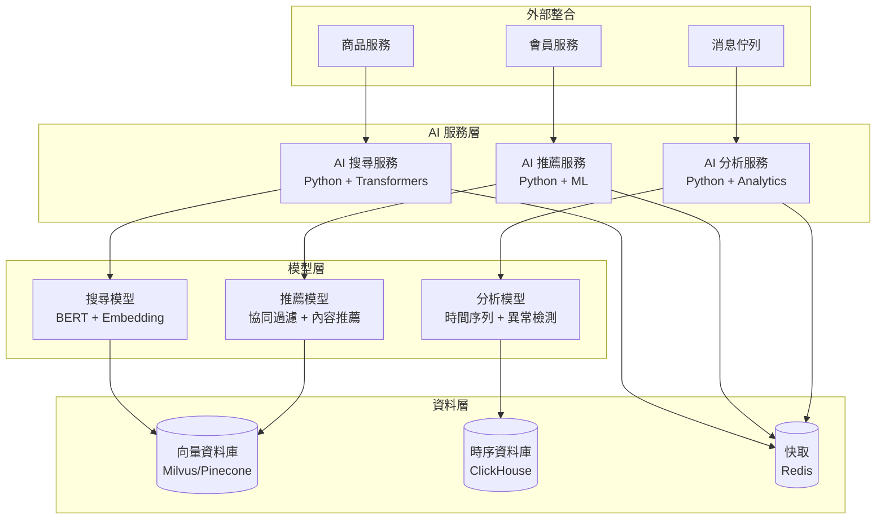
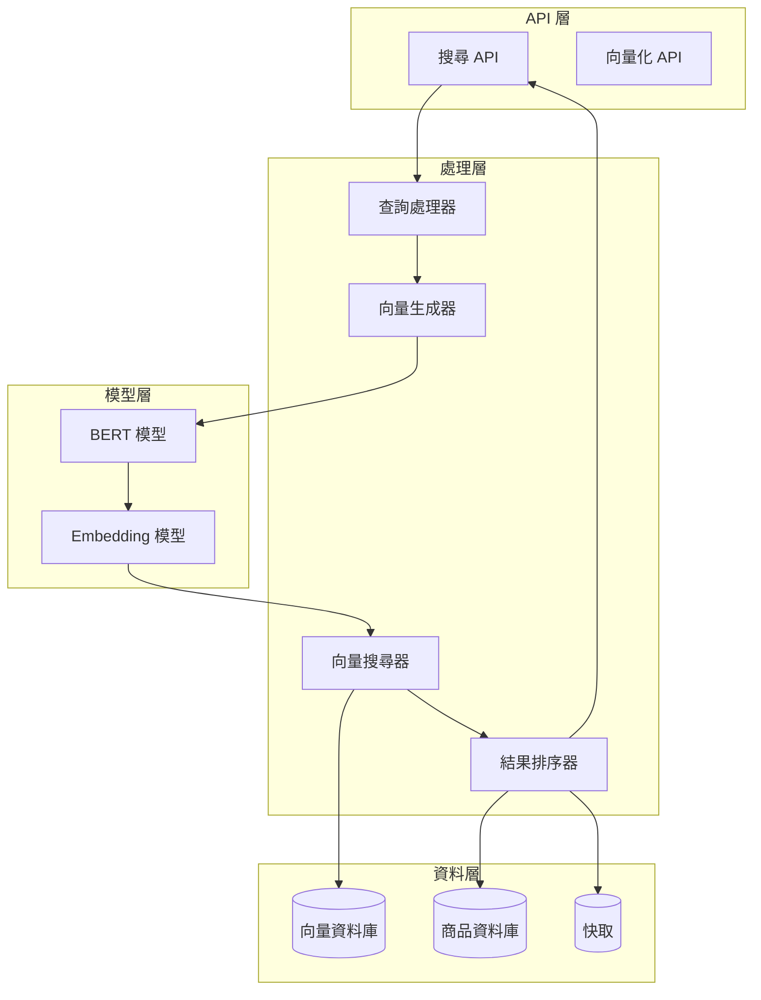
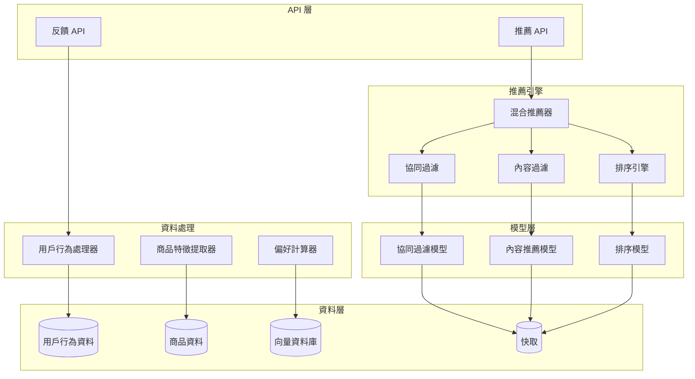
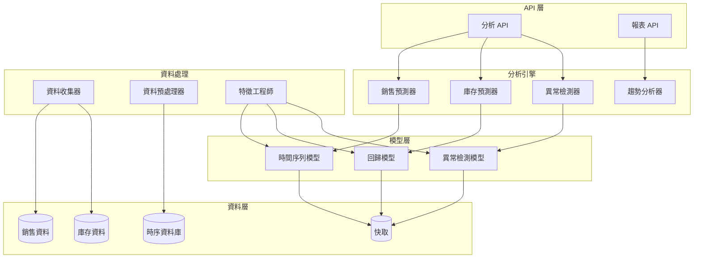
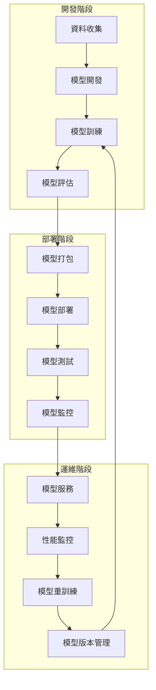

# AI 服務設計文檔 (AI Services Design Document) - 電商系統

---

**文件版本 (Document Version):** v1.0

**最後更新 (Last Updated):** 2025-01-03

**主要作者/設計師 (Lead Author/Designer):** AI 系統設計師

**審核者 (Reviewers):** AI 團隊、架構師、產品經理

**狀態 (Status):** 設計中 (In Design)

**相關系統架構文檔 (SA Document):** [02_system_architecture_document.md](./02_system_architecture_document.md)

**相關 User Stories/Features:** US-002 (AI 搜尋), US-003 (AI 推薦), US-005 (AI 分析)

---

## 目錄 (Table of Contents)

1. [引言 (Introduction)](#1-引言-introduction)
2. [AI 服務概述 (AI Services Overview)](#2-ai-服務概述-ai-services-overview)
3. [AI 搜尋服務設計 (AI Search Service Design)](#3-ai-搜尋服務設計-ai-search-service-design)
4. [AI 推薦服務設計 (AI Recommendation Service Design)](#4-ai-推薦服務設計-ai-recommendation-service-design)
5. [AI 分析服務設計 (AI Analytics Service Design)](#5-ai-分析服務設計-ai-analytics-service-design)
6. [模型管理與部署 (Model Management and Deployment)](#6-模型管理與部署-model-management-and-deployment)
7. [性能與擴展性 (Performance and Scalability)](#7-性能與擴展性-performance-and-scalability)
8. [監控與可觀測性 (Monitoring and Observability)](#8-監控與可觀測性-monitoring-and-observability)
9. [安全性考量 (Security Considerations)](#9-安全性考量-security-considerations)
10. [未來展望 (Future Considerations)](#10-未來展望-future-considerations)

---

## 1. 引言 (Introduction)

### 1.1 目的 (Purpose)
*   為電商系統的 AI 服務提供詳細的設計規格，包括搜尋、推薦和分析三大核心 AI 功能
*   確保 AI 服務與整體系統架構的一致性，並提供可擴展的 AI 解決方案

### 1.2 範圍 (Scope)
*   涵蓋 AI 搜尋服務、AI 推薦服務、AI 分析服務的詳細設計
*   包括模型選擇、架構設計、API 設計、部署策略等

### 1.3 術語表 (Glossary)

| 術語/縮寫 | 完整名稱/解釋 |
| :------- | :----------- |
| ML | Machine Learning (機器學習) |
| NLP | Natural Language Processing (自然語言處理) |
| Embedding | 向量嵌入，將文字轉換為數值向量 |
| Transformer | 基於注意力機制的神經網路架構 |
| BERT | Bidirectional Encoder Representations from Transformers |
| Collaborative Filtering | 協同過濾，基於用戶行為的推薦方法 |
| Content-Based Filtering | 內容過濾，基於商品特徵的推薦方法 |
| Time Series | 時間序列，按時間順序排列的數據 |
| Anomaly Detection | 異常檢測，識別異常模式或行為 |

---

## 2. AI 服務概述 (AI Services Overview)

### 2.1 AI 服務架構



### 2.2 技術選型

| 服務 | 主要技術 | 模型類型 | 部署方式 |
|------|----------|----------|----------|
| **AI 搜尋** | Python + Transformers | BERT + Embedding | Docker + GPU |
| **AI 推薦** | Python + Scikit-learn | 協同過濾 + 內容推薦 | Docker + CPU/GPU |
| **AI 分析** | Python + Pandas + Prophet | 時間序列 + 異常檢測 | Docker + CPU |

### 2.3 服務職責

*   **AI 搜尋服務:** 
    *   語意搜尋處理
    *   查詢向量化
    *   相似度計算
    *   搜尋結果排序
*   **AI 推薦服務:**
    *   個人化推薦生成
    *   協同過濾計算
    *   內容推薦處理
    *   推薦結果優化
*   **AI 分析服務:**
    *   銷售預測
    *   庫存預測
    *   異常檢測
    *   趨勢分析

---

## 3. AI 搜尋服務設計 (AI Search Service Design)

### 3.1 服務架構



### 3.2 核心功能

#### 3.2.1 語意搜尋
*   **功能描述:** 理解用戶的自然語言查詢，返回相關商品
*   **技術實現:** 
    *   使用 BERT 模型進行查詢理解
    *   生成查詢向量
    *   在向量資料庫中搜尋相似商品
*   **API 端點:** `POST /api/v1/search/semantic`

#### 3.2.2 關鍵字建議
*   **功能描述:** 根據用戶輸入提供搜尋建議
*   **技術實現:**
    *   基於歷史搜尋記錄
    *   使用 N-gram 模型
    *   結合商品標籤和分類
*   **API 端點:** `GET /api/v1/search/suggestions`

#### 3.2.3 商品向量化
*   **功能描述:** 將商品資訊轉換為向量表示
*   **技術實現:**
    *   結合商品名稱、描述、屬性
    *   使用預訓練的 BERT 模型
    *   定期更新商品向量
*   **觸發時機:** 商品創建、更新時

### 3.3 模型設計

#### 3.3.1 BERT 模型配置
```python
# 模型配置
model_config = {
    "model_name": "bert-base-chinese",
    "max_length": 512,
    "embedding_dim": 768,
    "batch_size": 32,
    "learning_rate": 2e-5
}

# 向量化配置
embedding_config = {
    "normalize": True,
    "similarity_metric": "cosine",
    "top_k": 100
}
```

#### 3.3.2 搜尋流程
```python
def semantic_search(query: str, filters: dict) -> List[SearchResult]:
    # 1. 查詢預處理
    processed_query = preprocess_query(query)
    
    # 2. 生成查詢向量
    query_embedding = generate_embedding(processed_query)
    
    # 3. 向量搜尋
    similar_products = vector_search(query_embedding, filters)
    
    # 4. 結果排序
    ranked_results = rank_results(similar_products, query)
    
    # 5. 後處理
    final_results = post_process(ranked_results)
    
    return final_results
```

### 3.4 模型評估指標 (Model Evaluation Metrics)

*   **離線評估 (Offline Evaluation):**
    *   **Mean Reciprocal Rank (MRR):** 衡量模型將第一個相關結果排在前面的能力。
    *   **Normalized Discounted Cumulative Gain (nDCG@k):** 評估排名前 k 個結果的相關性排序品質。
    *   **Hit Rate@k:** 計算前 k 個結果中至少包含一個相關項的查詢比例。
*   **線上評估 (Online Evaluation):**
    *   **點擊率 (Click-Through Rate, CTR):** 用戶點擊搜尋結果的頻率。
    *   **轉換率 (Conversion Rate, CVR):** 用戶在搜尋後完成購買的比例。
    *   **無結果搜尋率 (Zero Result Rate):** 返回空結果的搜尋查詢比例。

### 3.5 性能優化

*   **快取策略:** 
    *   熱門查詢結果快取 (TTL: 1小時)
    *   商品向量快取 (TTL: 24小時)
    *   Redis 分散式快取
*   **並行處理:** 
    *   查詢向量化並行處理
    *   多個向量搜尋實例
    *   異步結果處理
*   **GPU 加速:** 
    *   BERT 模型 GPU 推理
    *   批量向量化處理

---

## 4. AI 推薦服務設計 (AI Recommendation Service Design)

### 4.1 服務架構



### 4.2 核心功能

#### 4.2.1 個人化推薦
*   **功能描述:** 為每個用戶生成個人化的商品推薦
*   **技術實現:**
    *   協同過濾：基於相似用戶的行為
    *   內容推薦：基於用戶偏好和商品特徵
    *   混合推薦：結合多種推薦方法
*   **API 端點:** `GET /api/v1/recommendations/personalized`

#### 4.2.2 相似商品推薦
*   **功能描述:** 為指定商品推薦相似商品
*   **技術實現:**
    *   基於商品特徵向量
    *   使用餘弦相似度計算
    *   考慮商品類別和屬性
*   **API 端點:** `GET /api/v1/recommendations/similar/{productId}`

#### 4.2.3 即時推薦
*   **功能描述:** 根據用戶當前行為即時調整推薦
*   **技術實現:**
    *   實時用戶行為分析
    *   動態偏好更新
    *   上下文感知推薦

### 4.3 推薦演算法

#### 4.3.1 協同過濾
```python
class CollaborativeFilter:
    def __init__(self):
        self.user_item_matrix = None
        self.similarity_matrix = None
    
    def fit(self, user_behavior_data):
        # 構建用戶-商品矩陣
        self.user_item_matrix = self.build_matrix(user_behavior_data)
        
        # 計算用戶相似度
        self.similarity_matrix = self.calculate_similarity()
    
    def recommend(self, user_id, n_recommendations=10):
        # 找到相似用戶
        similar_users = self.find_similar_users(user_id)
        
        # 基於相似用戶偏好生成推薦
        recommendations = self.generate_recommendations(similar_users)
        
        return recommendations[:n_recommendations]
```

#### 4.3.2 內容推薦
```python
class ContentBasedFilter:
    def __init__(self):
        self.product_features = None
        self.user_profiles = None
    
    def fit(self, product_data, user_behavior_data):
        # 提取商品特徵
        self.product_features = self.extract_features(product_data)
        
        # 構建用戶偏好檔案
        self.user_profiles = self.build_user_profiles(user_behavior_data)
    
    def recommend(self, user_id, n_recommendations=10):
        # 獲取用戶偏好檔案
        user_profile = self.user_profiles[user_id]
        
        # 計算商品與用戶偏好的相似度
        similarities = self.calculate_similarities(user_profile)
        
        # 排序並返回推薦
        recommendations = self.rank_by_similarity(similarities)
        
        return recommendations[:n_recommendations]
```

#### 4.3.3 混合推薦
```python
class HybridRecommender:
    def __init__(self, cf_weight=0.6, cb_weight=0.4):
        self.cf_weight = cf_weight
        self.cb_weight = cb_weight
        self.collaborative_filter = CollaborativeFilter()
        self.content_filter = ContentBasedFilter()
    
    def recommend(self, user_id, n_recommendations=10):
        # 獲取協同過濾推薦
        cf_recommendations = self.collaborative_filter.recommend(user_id)
        
        # 獲取內容推薦
        cb_recommendations = self.content_filter.recommend(user_id)
        
        # 混合推薦結果
        hybrid_recommendations = self.combine_recommendations(
            cf_recommendations, cb_recommendations
        )
        
        return hybrid_recommendations[:n_recommendations]
```

### 4.4 模型評估指標 (Model Evaluation Metrics)

*   **離線評估 (Offline Evaluation):**
    *   **Precision@k / Recall@k:** 評估排名前 k 個推薦的準確性和召回率。
    *   **Mean Average Precision (MAP):** 綜合考慮排序品質的推薦準確率。
    *   **覆蓋率 (Coverage):** 衡量推薦系統能夠推薦的物品佔總物品比例。
    *   **新穎性 (Novelty):** 評估推薦非熱門商品的能力。
*   **線上評估 (Online Evaluation):**
    *   **點擊率 (Click-Through Rate, CTR):** 用戶點擊推薦商品的頻率。
    *   **轉換率 (Conversion Rate, CVR):** 用戶因推薦而完成購買的比例。
    *   **推薦接受度 (Acceptance Rate):** 用戶對推薦內容的正面反饋比例。

### 4.5 模型訓練與更新

*   **離線訓練:** 
    *   每日凌晨進行模型重訓練
    *   使用過去 30 天的用戶行為資料
    *   模型版本管理和 A/B 測試
*   **線上更新:** 
    *   實時更新用戶偏好檔案
    *   增量學習和模型微調
    *   動態權重調整

---

## 5. AI 分析服務設計 (AI Analytics Service Design)

### 5.1 服務架構



### 5.2 核心功能

#### 5.2.1 銷售預測
*   **功能描述:** 預測未來銷售趨勢和需求量
*   **技術實現:**
    *   時間序列分析 (ARIMA, Prophet)
    *   考慮季節性、趨勢和週期性
    *   多變量回歸模型
*   **API 端點:** `GET /api/v1/analytics/sales-forecast`

#### 5.2.2 庫存預測
*   **功能描述:** 預測商品庫存需求和補貨時機
*   **技術實現:**
    *   基於銷售預測的庫存模型
    *   考慮供應鏈延遲
    *   安全庫存計算
*   **API 端點:** `GET /api/v1/analytics/inventory-prediction/{productId}`

#### 5.2.3 異常檢測
*   **功能描述:** 識別銷售、庫存、用戶行為異常
*   **技術實現:**
    *   Isolation Forest 異常檢測
    *   統計控制圖
    *   機器學習異常檢測
*   **API 端點:** `GET /api/v1/analytics/anomalies`

#### 5.2.4 趨勢分析
*   **功能描述:** 分析業務趨勢和模式
*   **技術實現:**
    *   時間序列分解
    *   趨勢識別和預測
    *   相關性分析

### 5.3 預測模型

#### 5.3.1 時間序列預測
```python
class TimeSeriesPredictor:
    def __init__(self, model_type="prophet"):
        self.model_type = model_type
        self.model = None
    
    def fit(self, time_series_data):
        if self.model_type == "prophet":
            self.model = Prophet(
                yearly_seasonality=True,
                weekly_seasonality=True,
                daily_seasonality=False
            )
            self.model.fit(time_series_data)
        elif self.model_type == "arima":
            self.model = ARIMA(time_series_data, order=(1, 1, 1))
            self.model.fit()
    
    def predict(self, periods=30):
        if self.model_type == "prophet":
            future = self.model.make_future_dataframe(periods=periods)
            forecast = self.model.predict(future)
            return forecast[['ds', 'yhat', 'yhat_lower', 'yhat_upper']]
        elif self.model_type == "arima":
            forecast = self.model.forecast(steps=periods)
            return forecast
```

#### 5.3.2 異常檢測
```python
class AnomalyDetector:
    def __init__(self, method="isolation_forest"):
        self.method = method
        self.model = None
    
    def fit(self, data):
        if self.method == "isolation_forest":
            self.model = IsolationForest(
                contamination=0.1,
                random_state=42
            )
            self.model.fit(data)
        elif self.method == "statistical":
            self.model = StatisticalAnomalyDetector()
            self.model.fit(data)
    
    def detect(self, data):
        if self.method == "isolation_forest":
            predictions = self.model.predict(data)
            anomalies = data[predictions == -1]
            return anomalies
        elif self.method == "statistical":
            anomalies = self.model.detect(data)
            return anomalies
```

### 5.4 模型評估指標 (Model Evaluation Metrics)

*   **銷售/庫存預測模型:**
    *   **Mean Absolute Error (MAE):** 預測誤差的平均絕對值。
    *   **Root Mean Squared Error (RMSE):** 衡量預測值與真實值之間的偏差。
    *   **Mean Absolute Percentage Error (MAPE):** 以百分比形式表示預測誤差。
    *   **R-squared (R²):** 評估模型對數據變異性的解釋能力。
*   **異常檢測模型:**
    *   **Precision / Recall / F1-Score:** 評估檢測異常事件的準確性、召回率和綜合表現。
    *   **Area Under the ROC Curve (AUC-ROC):** 衡量模型區分正常與異常樣本的能力。

### 5.5 資料處理

*   **資料收集:** 
    *   實時資料流處理 (Kafka)
    *   批次資料處理 (每日/每週)
    *   資料品質檢查和清洗
*   **特徵工程:** 
    *   時間特徵提取 (季節性、節假日)
    *   業務特徵構建 (促銷、活動)
    *   外部特徵整合 (天氣、經濟指標)
*   **模型評估:** 
    *   MAE, RMSE, MAPE 指標
    *   交叉驗證
    *   模型穩定性測試

---

## 6. 模型管理與部署 (Model Management and Deployment)

### 6.1 模型生命週期管理



### 6.2 部署策略

#### 6.2.1 容器化部署
```dockerfile
# AI 服務 Dockerfile
FROM python:3.9-slim

WORKDIR /app

# 安裝依賴
COPY requirements.txt .
RUN pip install -r requirements.txt

# 複製模型檔案
COPY models/ ./models/
COPY src/ ./src/

# 設定環境變數
ENV MODEL_PATH=/app/models
ENV GPU_ENABLED=true

# 啟動服務
CMD ["python", "src/main.py"]
```

#### 6.2.2 Kubernetes 部署
```yaml
# AI 服務 Kubernetes 配置
apiVersion: apps/v1
kind: Deployment
metadata:
  name: ai-search-service
spec:
  replicas: 3
  selector:
    matchLabels:
      app: ai-search-service
  template:
    metadata:
      labels:
        app: ai-search-service
    spec:
      containers:
      - name: ai-search
        image: ecommerce/ai-search:v1.2.0
        ports:
        - containerPort: 8080
        resources:
          requests:
            memory: "2Gi"
            cpu: "1"
          limits:
            memory: "4Gi"
            cpu: "2"
        env:
        - name: MODEL_PATH
          value: "/app/models"
        - name: GPU_ENABLED
          value: "true"
```

### 6.3 模型版本管理

*   **版本控制:** 
    *   Git LFS 管理大型模型檔案
    *   模型版本標籤和描述
    *   模型變更日誌
*   **A/B 測試:** 
    *   新舊模型並行部署
    *   流量分配策略
    *   效果對比分析
*   **回滾機制:** 
    *   快速模型回滾
    *   版本切換策略
    *   資料一致性保證

---

## 7. 性能與擴展性 (Performance and Scalability)

### 7.1 性能指標

| 指標 | 目標值 | 監控方式 |
|------|--------|----------|
| **搜尋響應時間** | < 200ms (P95) | Prometheus + Grafana |
| **推薦響應時間** | < 100ms (P95) | Prometheus + Grafana |
| **分析響應時間** | < 500ms (P95) | Prometheus + Grafana |
| **模型準確率** | > 85% | 定期評估 |
| **系統可用性** | > 99.5% | 健康檢查 |

### 7.2 擴展策略

#### 7.2.1 水平擴展
*   **服務實例擴展:** Kubernetes HPA 自動擴展
*   **模型實例擴展:** 多個模型服務實例
*   **資料庫擴展:** 向量資料庫叢集

#### 7.2.2 快取策略
*   **模型快取:** 熱門模型記憶體快取
*   **結果快取:** 搜尋和推薦結果快取
*   **特徵快取:** 用戶特徵和商品特徵快取

#### 7.2.3 異步處理
*   **模型訓練:** 異步模型訓練和更新
*   **資料處理:** 批次資料處理
*   **結果生成:** 非即時結果異步生成

### 7.3 資源優化

*   **GPU 資源管理:** 
    *   GPU 共享和排程
    *   模型量化優化
    *   動態 GPU 分配
*   **記憶體優化:** 
    *   模型記憶體映射
    *   批次處理優化
    *   垃圾回收調優
*   **網路優化:** 
    *   模型服務本地化
    *   資料傳輸壓縮
    *   CDN 快取

---

## 8. 監控與可觀測性 (Monitoring and Observability)

### 8.1 監控指標

#### 8.1.1 業務指標
*   **搜尋相關:** 
    *   搜尋成功率
    *   搜尋結果點擊率
    *   搜尋轉換率
*   **推薦相關:** 
    *   推薦點擊率
    *   推薦轉換率
    *   推薦準確率
*   **分析相關:** 
    *   預測準確率
    *   異常檢測準確率
    *   報表生成成功率

#### 8.1.2 技術指標
*   **性能指標:** 
    *   API 響應時間
    *   模型推理時間
    *   系統吞吐量
*   **資源指標:** 
    *   CPU 使用率
    *   記憶體使用率
    *   GPU 使用率
*   **錯誤指標:** 
    *   錯誤率
    *   超時率
    *   模型失敗率

### 8.2 日誌管理

```python
# 結構化日誌範例
import logging
import json

class AIServiceLogger:
    def __init__(self):
        self.logger = logging.getLogger(__name__)
    
    def log_search_request(self, query, user_id, response_time, results_count):
        log_data = {
            "event_type": "search_request",
            "query": query,
            "user_id": user_id,
            "response_time": response_time,
            "results_count": results_count,
            "timestamp": datetime.utcnow().isoformat()
        }
        self.logger.info(json.dumps(log_data))
    
    def log_model_prediction(self, model_name, input_data, prediction, confidence):
        log_data = {
            "event_type": "model_prediction",
            "model_name": model_name,
            "input_data": input_data,
            "prediction": prediction,
            "confidence": confidence,
            "timestamp": datetime.utcnow().isoformat()
        }
        self.logger.info(json.dumps(log_data))
```

### 8.3 告警機制

*   **性能告警:** 
    *   響應時間超標
    *   錯誤率過高
    *   資源使用率過高
*   **業務告警:** 
    *   模型準確率下降
    *   異常檢測觸發
    *   推薦效果異常
*   **系統告警:** 
    *   服務不可用
    *   模型載入失敗
    *   資料同步異常

---

## 9. 安全性考量 (Security Considerations)

### 9.1 模型安全

*   **輸入驗證:** 
    *   查詢參數驗證
    *   模型輸入清理
    *   惡意輸入檢測
*   **對抗攻擊防護:** 
    *   對抗樣本檢測
    *   模型魯棒性增強
    *   輸入擾動防護
*   **模型保護:** 
    *   模型檔案加密
    *   模型 API 認證
    *   模型版本控制

### 9.2 資料安全

*   **資料隱私:** 
    *   個人資料脫敏
    *   資料匿名化
    *   隱私保護演算法
*   **資料傳輸:** 
    *   TLS 加密傳輸
    *   資料完整性檢查
    *   安全通訊協議
*   **資料儲存:** 
    *   資料庫加密
    *   備份資料加密
    *   存取權限控制

### 9.3 系統安全

*   **API 安全:** 
    *   API 認證授權
    *   速率限制
    *   CORS 配置
*   **容器安全:** 
    *   容器映像掃描
    *   運行時安全監控
    *   最小權限原則
*   **網路安全:** 
    *   網路隔離
    *   防火牆配置
    *   入侵檢測

---

## 10. 未來展望 (Future Considerations)

### 10.1 技術演進

*   **模型優化:** 
    *   更先進的 Transformer 模型
    *   圖神經網路 (GNN) 應用
    *   多模態模型整合
*   **架構改進:** 
    *   邊緣計算部署
    *   聯邦學習
    *   自動機器學習 (AutoML)

### 10.2 功能擴展

*   **視覺搜尋:** 
    *   圖像識別搜尋
    *   相似圖片推薦
    *   視覺商品標籤
*   **語音搜尋:** 
    *   語音識別
    *   語音助手整合
    *   多語言支援
*   **聊天機器人:** 
    *   智能客服
    *   購物助手
    *   個人化對話

### 10.3 業務價值

*   **用戶體驗提升:** 
    *   更精準的搜尋結果
    *   更相關的推薦
    *   更智能的購物體驗
*   **營運效率提升:** 
    *   自動化庫存管理
    *   智能營銷策略
    *   預測性維護
*   **商業洞察:** 
    *   深度業務分析
    *   市場趨勢預測
    *   競爭情報分析

---

**文件審核記錄 (Review History):**

| 日期 | 審核人 | 版本 | 變更摘要/主要反饋 |
| :--------- | :--------- | :--- | :---------------------------------------------- |
| 2025-01-03 | AI 系統設計師 | v1.0 | 初稿提交，涵蓋 AI 服務完整設計 |
