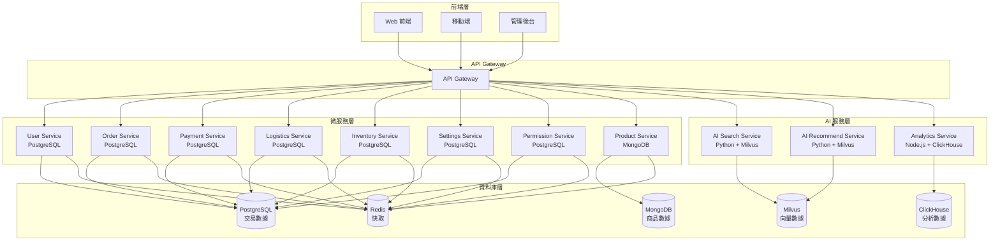

# 階段3準備計劃 (Phase 3 Preparation Plan)

---

**文件版本 (Document Version):** v1.0  
**創建日期 (Created Date):** 2025-09-07  
**狀態 (Status):** 準備開始  
**前置條件**: ✅ 階段2完成 - 所有服務遷移成功

---

## 目錄 (Table of Contents)

1. [階段3概述 (Phase 3 Overview)](#1-階段3概述-phase-3-overview)
2. [AI 服務整合計劃 (AI Services Integration Plan)](#2-ai-服務整合計劃-ai-services-integration-plan)
3. [技術架構設計 (Technical Architecture Design)](#3-技術架構設計-technical-architecture-design)
4. [實施步驟 (Implementation Steps)](#4-實施步驟-implementation-steps)
5. [風險評估 (Risk Assessment)](#5-風險評估-risk-assessment)
6. [成功標準 (Success Criteria)](#6-成功標準-success-criteria)

---

## 1. 階段3概述 (Phase 3 Overview)

### 1.1 目標
階段3的主要目標是整合 AI 服務和專業化資料庫，提升系統的智能化能力和數據處理效率。

### 1.2 範圍
- **向量資料庫整合**: Milvus/Pinecone 用於推薦系統和搜尋功能
- **時間序列資料庫整合**: ClickHouse 用於分析報表和監控
- **快取層優化**: Redis 整合提升系統性能

### 1.3 預期成果
- ✅ AI 搜尋服務上線
- ✅ AI 推薦服務上線
- ✅ 分析服務優化
- ✅ 系統性能提升

---

## 2. AI 服務整合計劃 (AI Services Integration Plan)

### 2.1 向量資料庫整合

#### 2.1.1 Milvus 向量資料庫
**用途**: 推薦系統、相似商品搜尋
- **部署方式**: Docker 容器
- **數據類型**: 商品向量、用戶行為向量
- **整合服務**: AI 推薦服務

#### 2.1.2 Pinecone 向量資料庫 (備選)
**用途**: 雲端向量搜尋服務
- **部署方式**: 雲端服務
- **優勢**: 免維護、高可用
- **適用場景**: 快速原型開發

### 2.2 時間序列資料庫整合

#### 2.2.1 ClickHouse
**用途**: 分析報表、用戶行為分析
- **部署方式**: Docker 容器
- **數據類型**: 用戶行為日誌、交易數據
- **整合服務**: 分析服務

### 2.3 快取層優化

#### 2.3.1 Redis
**用途**: 會話管理、API 快取、熱點數據
- **部署方式**: Docker 容器
- **配置**: 主從複製、持久化
- **整合服務**: 所有微服務

---

## 3. 技術架構設計 (Technical Architecture Design)

### 3.1 系統架構圖



### 3.2 數據流設計

#### 3.2.1 向量數據流
```
商品數據 (MongoDB) → 向量化處理 → Milvus → AI 服務
用戶行為 → 向量化處理 → Milvus → 推薦算法
```

#### 3.2.2 分析數據流
```
用戶行為 → ClickHouse → 分析服務 → 報表
交易數據 → ClickHouse → 分析服務 → 儀表板
```

#### 3.2.3 快取數據流
```
熱點數據 → Redis → 微服務 → 快速響應
會話數據 → Redis → 認證服務 → 用戶狀態
```

---

## 4. 實施步驟 (Implementation Steps)

### 4.1 第一階段：基礎設施準備

#### 4.1.1 Docker 環境準備
- [ ] 安裝 Docker 和 Docker Compose
- [ ] 配置網路和存儲
- [ ] 準備環境變數配置

#### 4.1.2 資料庫部署
- [ ] 部署 Milvus 向量資料庫
- [ ] 部署 ClickHouse 時間序列資料庫
- [ ] 部署 Redis 快取資料庫
- [ ] 配置資料庫連接和認證

### 4.2 第二階段：AI 服務開發

#### 4.2.1 AI 搜尋服務
- [ ] 設計搜尋 API 接口
- [ ] 實現向量化處理邏輯
- [ ] 整合 Milvus 查詢功能
- [ ] 實現搜尋結果排序

#### 4.2.2 AI 推薦服務
- [ ] 設計推薦算法
- [ ] 實現協同過濾
- [ ] 整合用戶行為數據
- [ ] 實現個性化推薦

#### 4.2.3 分析服務優化
- [ ] 遷移分析服務到 ClickHouse
- [ ] 實現實時分析功能
- [ ] 設計分析報表 API
- [ ] 實現數據可視化

### 4.3 第三階段：系統整合

#### 4.3.1 API Gateway 整合
- [ ] 添加 AI 服務路由
- [ ] 配置負載均衡
- [ ] 實現服務發現
- [ ] 配置監控和日誌

#### 4.3.2 快取層整合
- [ ] 為所有服務添加 Redis 快取
- [ ] 實現快取策略
- [ ] 配置快取失效機制
- [ ] 監控快取性能

### 4.4 第四階段：測試和優化

#### 4.4.1 功能測試
- [ ] AI 搜尋功能測試
- [ ] AI 推薦功能測試
- [ ] 分析服務功能測試
- [ ] 快取功能測試

#### 4.4.2 性能測試
- [ ] 向量搜尋性能測試
- [ ] 分析查詢性能測試
- [ ] 快取命中率測試
- [ ] 整體系統性能測試

#### 4.4.3 優化調整
- [ ] 查詢性能優化
- [ ] 快取策略優化
- [ ] 資源使用優化
- [ ] 錯誤處理優化

---

## 5. 風險評估 (Risk Assessment)

### 5.1 技術風險

#### 5.1.1 向量資料庫風險
- **風險**: Milvus 部署複雜度高
- **影響**: 中等
- **緩解措施**: 準備 Pinecone 備選方案

#### 5.1.2 性能風險
- **風險**: AI 服務可能影響系統性能
- **影響**: 高
- **緩解措施**: 異步處理、負載均衡

#### 5.1.3 數據一致性風險
- **風險**: 多資料庫間數據同步問題
- **影響**: 高
- **緩解措施**: 事件驅動架構、數據驗證

### 5.2 運營風險

#### 5.2.1 維護複雜度
- **風險**: 多個資料庫增加維護複雜度
- **影響**: 中等
- **緩解措施**: 自動化運維、監控告警

#### 5.2.2 成本風險
- **風險**: 多個資料庫增加運營成本
- **影響**: 低
- **緩解措施**: 資源優化、成本監控

---

## 6. 成功標準 (Success Criteria)

### 6.1 功能標準
- ✅ AI 搜尋服務正常運行
- ✅ AI 推薦服務正常運行
- ✅ 分析服務性能提升 50%
- ✅ 快取命中率達到 80%

### 6.2 性能標準
- ✅ 搜尋響應時間 < 200ms
- ✅ 推薦響應時間 < 500ms
- ✅ 分析查詢響應時間 < 1s
- ✅ 系統整體可用性 > 99.9%

### 6.3 質量標準
- ✅ 所有 API 通過測試
- ✅ 數據一致性檢查通過
- ✅ 安全審查通過
- ✅ 文檔完整性檢查通過

---

## 準備檢查清單 (Preparation Checklist)

### 環境準備
- [ ] Docker 環境就緒
- [ ] 網路配置完成
- [ ] 存儲空間充足
- [ ] 環境變數配置

### 開發準備
- [ ] Python 開發環境
- [ ] AI/ML 庫安裝
- [ ] 開發工具配置
- [ ] 測試環境準備

### 運維準備
- [ ] 監控工具配置
- [ ] 日誌收集配置
- [ ] 備份策略制定
- [ ] 災難恢復計劃

---

**準備狀態**: ✅ 階段2完成，可以開始階段3  
**預計開始時間**: 2025-09-07  
**預計完成時間**: 2025-09-10  
**負責團隊**: AI 服務開發團隊
