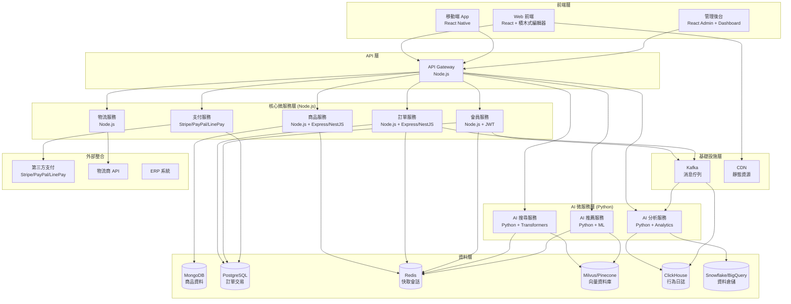

# 電商系統設計文檔總覽

本目錄包含電商系統的完整設計文檔，遵循業界最佳實踐的產品開發流程，從需求分析到生產部署的全生命週期文檔。

## 📋 文檔清單

### 1. 專案規劃階段
- **[00_project_brief_prd_summary.md](./00_project_brief_prd_summary.md)** - 專案簡報與 PRD 摘要
  - 專案概述、目標用戶、核心功能
  - 成功指標與里程碑規劃
  - 風險評估與依賴關係

### 2. 架構設計階段
- **[02_system_architecture_document.md](./02_system_architecture_document.md)** - 系統架構設計文檔
  - 高層次架構設計與技術選型
  - 微服務架構與組件關係
  - 非功能性需求與可行性分析

### 3. 架構決策記錄
- **[01_adr_001_microservices_architecture.md](./01_adr_001_microservices_architecture.md)** - ADR-001: 微服務架構選擇
- **[01_adr_002_database_technology_selection.md](./01_adr_002_database_technology_selection.md)** - ADR-002: 資料庫技術選型

### 4. 詳細設計階段
- **[03_system_design_document.md](./03_system_design_document.md)** - 系統詳細設計文檔
  - 核心服務詳細設計
  - 資料庫設計與 API 設計
  - 業務流程與狀態機設計

- **[04_api_design_specification.md](./04_api_design_specification.md)** - API 設計規範
  - RESTful API 設計標準
  - 完整的 API 端點定義
  - 資料模型與錯誤處理

- **[07_ai_services_design_document.md](./07_ai_services_design_document.md)** - AI 服務設計文檔
  - AI 搜尋服務設計
  - AI 推薦服務設計
  - AI 分析服務設計
  - 模型管理與部署策略

### 5. 安全與合規階段
- **[05_security_privacy_review_checklist.md](./05_security_privacy_review_checklist.md)** - 安全與隱私審查清單
  - 全面的安全檢查清單
  - 資料生命週期安全管理
  - 合規性要求與測試策略

### 6. 生產就緒階段
- **[06_production_readiness_review.md](./06_production_readiness_review.md)** - 生產就緒審查
  - 系統可靠性與可擴展性評估
  - 監控、告警與運維準備
  - 上線決策與風險評估

### 7. 架構修正階段 ✅
- **[08_architecture_refactoring_plan.md](./08_architecture_refactoring_plan.md)** - 架構修正計劃
  - ✅ **階段2完成**: 所有服務成功遷移到 PostgreSQL
  - User、Order、Permission、Payment、Logistics、Inventory、Settings 服務已遷移完成
  - 清理所有 MongoDB 依賴，確保環境乾淨
  - 所有服務健康檢查正常，API 功能完整
- **[09_phase1_completion_report.md](./09_phase1_completion_report.md)** - 階段1完成報告
  - 核心服務遷移成果
  - 技術實現細節
  - 測試結果與性能指標
- **[10_phase2_completion_report.md](./10_phase2_completion_report.md)** - 階段2完成報告
  - 其他服務遷移成果
  - API 功能測試結果
  - 系統穩定性評估
- **[11_phase3_preparation_plan.md](./11_phase3_preparation_plan.md)** - 階段3準備計劃
  - AI 服務整合計劃
  - 向量資料庫和時間序列資料庫設計
  - 實施步驟和風險評估

## 🏗️ 系統架構概覽

## 🎯 核心功能模組

| 模組 | 功能描述 | 主要 API | 設計技術棧 | 實際技術棧 | 狀態 |
|------|----------|----------|------------|------------|------|
| **商品管理** | 商品 CRUD、分類管理、庫存控制 | `/api/v1/products` | Node.js + MongoDB | Node.js + MongoDB | ✅ 正確 |
| **訂單管理** | 訂單創建、狀態流轉、退換貨 | `/api/v1/orders` | Node.js + PostgreSQL | Node.js + PostgreSQL | ✅ 已修正 |
| **會員管理** | 用戶註冊、個人資料、會員等級 | `/api/v1/users` | Node.js + PostgreSQL | Node.js + PostgreSQL | ✅ 已修正 |
| **權限管理** | RBAC 權限控制、角色管理 | `/api/v1/permissions` | Node.js + PostgreSQL | Node.js + PostgreSQL | ✅ 已修正 |
| **支付處理** | 多種支付方式、交易安全 | `/api/v1/payments` | Node.js + PostgreSQL | Node.js + PostgreSQL | ✅ 已修正 |
| **物流配送** | 配送選擇、物流追蹤 | `/api/v1/logistics` | Node.js + PostgreSQL | Node.js + PostgreSQL | ✅ 已修正 |
| **設定管理** | 系統設定、配置管理 | `/api/v1/settings` | Node.js + PostgreSQL | Node.js + PostgreSQL | ✅ 已修正 |
| **分析服務** | 營運分析、數據統計 | `/api/v1/analytics` | Node.js + ClickHouse | Node.js + MongoDB | ❌ 需修正 |
| **AI 搜尋** | 語意搜尋、多條件檢索 | `/api/v1/search` | Python + Milvus/Pinecone | ❌ 未實現 | ❌ 未實現 |
| **AI 推薦** | 個人化推薦、協同過濾 | `/api/v1/recommendations` | Python + Milvus/Pinecone | ❌ 未實現 | ❌ 未實現 |
| **API Gateway** | 統一 API 入口、路由、認證 | `/api/gateway` | Node.js | ❌ 未實現 | ❌ 未實現 |

## 🔧 技術棧

### 後端技術 (Node.js)
- **語言**: Node.js 18+
- **框架**: Express.js / NestJS
- **認證**: JWT + Redis Session
- **API 規格**: OpenAPI v3.x

### AI/ML 技術 (Python)
- **語言**: Python 3.9+
- **搜尋**: Hugging Face Transformers + Embedding
- **推薦**: Scikit-learn / LightFM + 協同過濾
- **分析**: Pandas / Numpy / Scikit-learn / Prophet / LSTM
- **異常偵測**: Isolation Forest

### 資料庫技術
- **商品資料**: MongoDB (靈活屬性結構)
- **交易資料**: PostgreSQL (ACID 特性)
- **快取**: Redis (會話管理和即時快取)
- **向量資料**: Milvus / Pinecone (AI 搜尋和推薦)
- **時序資料**: ClickHouse (行為日誌分析)
- **資料倉儲**: Snowflake / BigQuery / Redshift (商業智能)

### 前端技術
- **框架**: React 18+ / Vue 3+
- **狀態管理**: Redux Toolkit / Pinia
- **拖拉功能**: React DnD / Vue Draggable
- **UI 庫**: Ant Design / React Admin
- **打包工具**: Vite

### 基礎設施
- **雲服務**: AWS
- **容器化**: Docker + Kubernetes
- **消息佇列**: Apache Kafka / RabbitMQ
- **CI/CD**: GitHub Actions
- **監控**: Prometheus + Grafana
- **日誌**: ELK Stack
- **追蹤**: Jaeger

## 📊 非功能性需求

| 指標 | 目標值 | 當前狀態 |
|------|--------|----------|
| **可用性** | 99.9% | 🎯 目標設定 |
| **響應時間** | P95 < 500ms | 🎯 目標設定 |
| **吞吐量** | 10,000 TPS | 🎯 目標設定 |
| **錯誤率** | < 0.1% | 🎯 目標設定 |
| **擴展性** | 支持 10x 用戶增長 | 🎯 目標設定 |
| **AI 模型準確率** | > 85% | 🎯 目標設定 |

## 🛡️ 安全措施

- **認證**: OAuth 2.0 + JWT
- **授權**: 基於角色的存取控制 (RBAC)
- **加密**: TLS 1.3 (傳輸), AES-256 (儲存)
- **輸入驗證**: 全面的參數驗證和清理
- **機密管理**: AWS Secrets Manager
- **監控**: 安全事件日誌和告警
- **AI 安全**: 模型輸入驗證、對抗攻擊防護

## 📈 開發里程碑

| 階段 | 預期完成日期 | 主要交付物 | 狀態 |
|------|--------------|------------|------|
| **Alpha 版本** | 2025-03-31 | 核心功能開發完成 | 🔄 進行中 |
| **Beta 版本** | 2025-05-31 | AI 服務整合與優化 | ⏳ 計劃中 |
| **GA 版本** | 2025-07-31 | 正式發布 | ⏳ 計劃中 |

## 🚀 部署策略

- **部署方式**: 藍綠部署
- **容器編排**: Kubernetes
- **自動化**: GitHub Actions CI/CD
- **監控**: Prometheus + Grafana + PagerDuty
- **回滾**: 5 分鐘內自動回滾
- **AI 模型部署**: 模型版本管理、A/B 測試

## 📚 相關資源

- **API 文檔**: [Swagger UI](https://api.ecommerce.com/swagger-ui.html)
- **監控儀表板**: [Grafana Dashboard](https://grafana.ecommerce.com)
- **代碼倉庫**: [GitHub Repository](https://github.com/company/ecommerce-system)
- **部署文檔**: [Deployment Guide](../deployment/README.md)
- **AI 模型文檔**: [AI Models Documentation](../ai-models/README.md)

## 👥 團隊聯絡

- **架構師**: 系統架構師 (architect@company.com)
- **開發負責人**: 開發團隊負責人 (dev-lead@company.com)
- **AI 團隊**: AI 工程師 (ai-team@company.com)
- **產品經理**: 產品經理 (pm@company.com)
- **SRE**: SRE 團隊 (sre@company.com)

## ⚠️ 重要通知 (Important Notice)

### 🚨 架構問題發現
**發現時間**: 2025-09-06  
**問題描述**: 當前系統實現與設計文檔存在重大差異！

#### 主要問題
1. **資料庫架構不符**: 所有服務都使用 MongoDB，但設計要求使用 PostgreSQL
2. **缺失服務**: API Gateway 和 AI 服務尚未實現
3. **技術選型不一致**: 實際技術棧與設計文檔不符

#### 影響
- 數據一致性問題
- 查詢性能受限
- 擴展性不足
- 維護成本增加

#### 解決方案
- 📋 詳細修正計劃: [08_architecture_refactoring_plan.md](./08_architecture_refactoring_plan.md)
- ⏱️ 預估時間: 18 週 (約 4.5 個月)
- 🎯 目標: 完全符合設計文檔的架構

---

**最後更新**: 2025-09-06  
**文檔版本**: v1.2  
**維護者**: 電商系統開發團隊